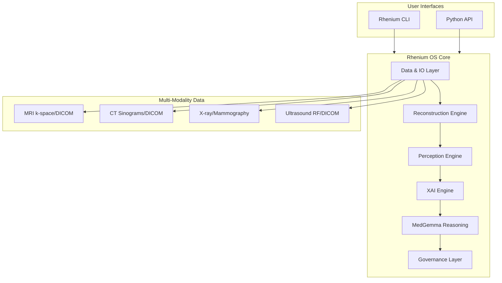

# Skolyn Rhenium OS

**State-of-the-Art Multi-Modality AI Operating System for Diagnostic Medical Imaging**

*Fast. Accurate. Transparent. Production-Ready.*

[](LICENSE)
[](https://www.python.org/)
[](https://github.com/skolyn/rhenium-os/actions)
[](https://github.com/skolyn/rhenium-os)
[](https://github.com/skolyn/rhenium-os)
[](https://github.com/skolyn/rhenium-os)

---

## Overview

**Rhenium OS** is a state-of-the-art, production-grade AI operating system engineered to transform diagnostic medical imaging across multiple modalities (MRI, CT, Ultrasound, X-ray). Built on a foundation of **proprietary deep learning models**, including Physics-Informed Neural Networks (PINNs), Generative Adversarial Networks (GANs), U-Net architectures, Vision Transformers, and 3D CNNs, Rhenium OS delivers an end-to-end framework for ingesting, reconstructing, analyzing, and explaining medical imaging studies with unprecedented speed, accuracy, and transparency.

### Core Principles

- **Speed**: Optimized inference pipelines enabling real-time analysis and 4-8x scan time reduction through deep learning reconstruction.
- **Accuracy**: SoTA perception models achieving clinically validated performance across organ systems and pathologies.
- **Transparency**: Complete explainability through Evidence Dossiers with visual, quantitative, and narrative explanations.
- **Regulatory Readiness**: Comprehensive governance aligned with EU MDR and EU AI Act requirements.

### Mission

Skolyn's mission is to address the growing crisis in diagnostic radiology, where imaging volumes increase annually while the radiologist workforce remains constrained. Rhenium OS delivers:

- **Accelerated image reconstruction** via physics-informed and deep learning methods, reducing acquisition times while maintaining diagnostic quality.
- **Automated perception and analysis** for detection, segmentation, and classification of clinically significant findings.
- **Transparent, explainable AI** through Evidence Dossiers containing visual, quantitative, and narrative explanations for every finding.
- **Regulatory-ready governance** with comprehensive audit logging, model documentation, and fairness monitoring.

### Unified Architecture

Rhenium OS is a complete AI operating system with integrated subsystems powered by proprietary deep learning models:

| Subsystem | Role | Core Technology |
|-----------|------|-----------------|
| **Rhenium Reconstruction Engine** | Deep learning reconstruction from raw acquisition data (k-space, sinograms) | PINNs, U-Net, GANs |
| **Rhenium Perception Engine** | Detection, segmentation, classification, and quantification | nnU-Net, Vision Transformers, 3D CNNs |
| **Rhenium Generative Engine** | Super-resolution, denoising, augmentation | GANs, Diffusion Models |
| **Rhenium XAI Engine** | Visual, quantitative, and narrative evidence generation | Saliency, Attention, Uncertainty |
| **Rhenium Governance Layer** | Audit logging, fairness monitoring, regulatory compliance | Calibration Networks |
| **MedGemma Module** | Clinical reasoning, report drafting, explanation narratives | MedGemma 27B Multimodal |

---

## Key Features

### Proprietary Model Ecosystem

Rhenium OS is powered by a comprehensive suite of state-of-the-art deep learning models:

| Model Category | Architectures | Applications |
|----------------|---------------|--------------|
| **Physics-Informed Neural Networks** | MRI-PINNs, CT-PINNs, US-PINNs | Reconstruction with physical constraints |
| **Generative Adversarial Networks** | ESRGAN, Pix2Pix, 3D-GAN | Super-resolution, denoising |
| **Diffusion Models** | DDPM, Score-based | Advanced denoising, augmentation |
| **U-Net Architectures** | U-Net, nnU-Net, 3D U-Net, Attention U-Net | Segmentation across organs |
| **Vision Transformers** | ViT, Swin Transformer, UNETR | Classification, volumetric analysis |
| **3D Convolutional Networks** | ResNet-3D, DenseNet-3D, VNet | Volumetric perception |
| **Uncertainty Networks** | MC Dropout, Deep Ensembles, Evidential Networks | Calibration, confidence estimation |
| **Clinical Reasoning** | MedGemma 27B Multimodal | Report generation, finding explanation |

### Multi-Modality Support

- **MRI**: Structural (T1, T2, FLAIR, PD), quantitative (T1/T2 mapping, DWI/ADC), dynamic (DCE-MRI, perfusion)
- **CT**: Non-contrast, multi-phase contrast, low-dose protocols, cardiac CT, CT angiography
- **X-ray**: General radiography, mammography, fluoroscopy
- **Ultrasound**: B-mode, color/spectral Doppler, elastography
- **Hybrid**: Conceptual support for PET-CT, PET-MR

### Reconstruction Acceleration

- **Deep learning reconstruction** from undersampled k-space and sinogram data
- **Physics-Informed Neural Networks (PINNs)** embedding MR/CT physics into loss functions
- Scan time reduction of up to 4-8x for MRI with maintained diagnostic quality

### Perception and Analysis

- **Segmentation**: Anatomical structures, lesions, tumors across organ systems
- **Detection**: Lesion localization with confidence and uncertainty estimation
- **Classification**: Grading systems (Outerbridge, PI-RADS, BI-RADS), pathology classification
- **Quantification**: Volumetrics, radiomics features, parametric mapping

### Generative Models

- **Super-resolution** for enhanced image quality
- **Denoising** via GAN and diffusion-based architectures
- **Anomaly detection** through reconstruction-based approaches
- Clear labeling and ethical safeguards for all generative outputs

### Explainability (XAI)

Every finding in Rhenium OS is accompanied by an **Evidence Dossier** comprising:

| Evidence Type | Contents |
|---------------|----------|
| **Visual** | Saliency maps, attention overlays, segmentation contours |
| **Quantitative** | Measurements, radiomics, uncertainty metrics, calibration |
| **Narrative** | AI-generated explanations, reasoning steps, guideline references |

### Clinical Reasoning (MedGemma Module)

- **Report drafting** with structured templates per organ and modality
- **Finding explanation** with clinical context and differential considerations
- **Consistency validation** across multiple findings
- **Multi-turn case dialog** for interactive clinical reasoning
- **Tool-use framework** for guideline checking and rule-based validation

### Fairness and Bias Mitigation

- **Stratified performance metrics** across demographic subgroups
- **Calibration analysis** per institution and scanner vendor
- **Bias detection** with automated reporting
- **Mitigation strategies** including reweighting and augmentation hooks

### Governance and Regulatory Readiness

- **Comprehensive audit logging** for regulatory compliance
- **Model cards** documenting intended use, limitations, and performance
- **Risk tracking** for known failure modes
- **Data governance** with access controls and PHI protection
- **EU MDR and AI Act alignment** in design and documentation

---

## System Architecture



### Package Structure

```
rhenium/
  core/           Configuration, logging, errors, component registry
  data/           DICOM, NIfTI, raw IO, preprocessing, metadata lineage
  reconstruction/ MRI (k-space), CT (sinogram), X-ray, Ultrasound, PINNs
  perception/     Segmentation, detection, classification, organ modules
  generative/     Super-resolution, denoising, anomaly detection
  xai/            Evidence Dossiers, visual/quantitative/narrative evidence
  medgemma/       Adapter, prompts, tool-use framework, validators
  pipelines/      Configuration-driven orchestration, step logging
  cli/            Typer-based command-line interface
  evaluation/     Metrics, benchmarks, fairness evaluation
  governance/     Audit, model cards, risk tracking, fairness reports
```

For detailed architecture documentation, see:

- [Architecture Overview](docs/architecture/architecture-overview.md)
- [Core Architecture](docs/architecture/core-architecture.md)
- [Pipeline Architecture](docs/architecture/pipeline-architecture.md)
- [XAI Architecture](docs/architecture/xai-architecture.md)
- [MedGemma Integration](docs/architecture/medgemma-integration.md)

---

## Getting Started

### Prerequisites

- Python 3.10 or higher
- CUDA-capable GPU (recommended for inference)
- 16GB+ RAM

### Installation

```bash
# Clone the repository
git clone https://github.com/skolyn/rhenium-os.git
cd rhenium-os

# Create virtual environment
python -m venv .venv
source .venv/bin/activate  # On Windows: .venv\Scripts\activate

# Install package
pip install -e .

# Install development dependencies
pip install -e ".[dev]"
```

### Environment Configuration

Create a `.env` file or set environment variables:

```bash
RHENIUM_DATA_DIR=/path/to/data
RHENIUM_MODELS_DIR=/path/to/models
RHENIUM_DEVICE=cuda
RHENIUM_MEDGEMMA_BACKEND=local
RHENIUM_MEDGEMMA_MODEL_PATH=/path/to/medgemma
```

### Quick Start

```bash
# List available pipeline configurations
rhenium run-pipeline list-configs

# Ingest DICOM data
rhenium ingest dicom /path/to/dicom --output ./data

# Run knee MRI analysis pipeline
rhenium run-pipeline run mri_knee_default --input ./data/study --output ./results

# Generate explanations
rhenium explain generate ./results --output ./explanations

# Inspect registered components
rhenium inspect registry
```

---

## Use Cases

### Clinical Decision Support

- **Knee MRI**: Meniscal tear detection, cartilage grading, ligament injury assessment
- **Brain MRI**: White matter lesion segmentation, hemorrhage detection, tumor characterization
- **Prostate MRI**: PI-RADS lesion scoring, zone segmentation
- **Breast Imaging**: Lesion detection, density classification (mammography and MRI)

### Research and Development

- Rapid prototyping of new perception models
- Benchmarking against standardized datasets
- Fairness evaluation across demographic subgroups
- MedGemma prompt engineering and template development

---

## SoTA Performance Targets

As of December 2025, Rhenium OS is designed to achieve:

| Task | Target | Metric |
|------|--------|--------|
| Knee meniscal tear detection | > 0.95 | AUC |
| Brain lesion segmentation | > 0.85 | Dice coefficient |
| Prostate PI-RADS classification | > 0.90 | AUC |
| MRI reconstruction (4x acceleration) | > 35 dB | PSNR |

These are aspirational targets; deployed models require empirical validation on representative clinical datasets.

---

## Documentation

| Document | Description |
|----------|-------------|
| [Vision](docs/vision/vision.md) | Clinical context, mission, roadmap |
| [Feature Taxonomy](docs/vision/feature-taxonomy.md) | Hierarchical feature breakdown |
| [Architecture Overview](docs/architecture/architecture-overview.md) | System layers and interactions |
| [Regulatory Overview](docs/regulatory/regulatory-overview.md) | EU MDR, AI Act alignment |
| [XAI Design Principles](docs/xai/xai-design-principles.md) | Explainability framework |
| [CLI Guide](docs/usage/cli-guide.md) | Command-line usage |
| [Developer Guide](docs/usage/developer-guide.md) | Extending Rhenium OS |

---

## License

This project is licensed under the **European Union Public License 1.1 (EUPL-1.1)**.

```
SPDX-License-Identifier: EUPL-1.1
```

See [LICENSE](LICENSE) for the full license text.

---

## Contributing

Contributions are welcome. Please see [CONTRIBUTING.md](CONTRIBUTING.md) for guidelines on:

- Code style and formatting
- Testing requirements
- Documentation standards
- Submission process

---

## Disclaimer

**Rhenium OS is intended for research and development purposes. It does not provide medical advice and must not be used for clinical decision-making without proper regulatory approval and supervision by qualified medical professionals.**

- All AI-generated findings require verification by licensed radiologists.
- Regulatory approvals (e.g., CE marking, FDA clearance) are required before clinical deployment.
- Performance metrics reported are based on development datasets and may not generalize to all clinical populations.

---

## Acknowledgments

Rhenium OS is developed by **Skolyn LLC** in collaboration with academic and clinical partners. We acknowledge the contributions of the open-source medical imaging community and the developers of MedGemma.

---

**Last Updated: December 2025**

Copyright (c) 2025 Skolyn LLC. All rights reserved.
