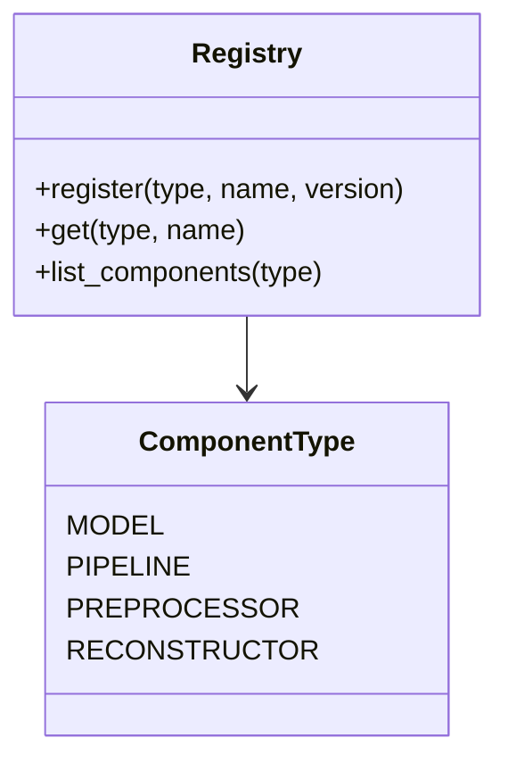
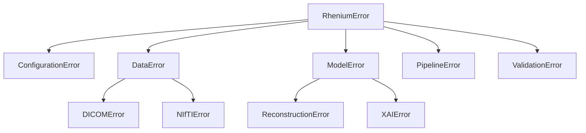

# Core API Reference

## Configuration

::: rhenium.core.config.RheniumSettings
    options:
      show_root_heading: true
      show_source: false

### Environment Variables

| Variable | Type | Default | Description |
|----------|------|---------|-------------|
| `RHENIUM_DATA_DIR` | Path | `./data` | Data directory |
| `RHENIUM_MODELS_DIR` | Path | `./models` | Model weights |
| `RHENIUM_DEVICE` | str | `auto` | Compute device |
| `RHENIUM_SEED` | int | `42` | Random seed |
| `RHENIUM_LOG_LEVEL` | str | `INFO` | Logging level |

---

## Component Registry



### Usage

```python
from rhenium.core.registry import registry, ComponentType

# Register a model
@registry.register(ComponentType.MODEL, "my_model", version="1.0.0")
class MyModel:
    pass

# Retrieve
model_cls = registry.get(ComponentType.MODEL, "my_model")
```

---

## Error Taxonomy



### Exception Classes

| Exception | Use Case |
|-----------|----------|
| `ConfigurationError` | Invalid settings |
| `DataError` | Data loading/format issues |
| `ModelError` | Model inference errors |
| `PipelineError` | Pipeline execution failures |
| `ValidationError` | Input/output validation |
