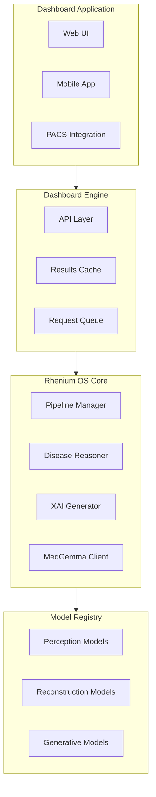
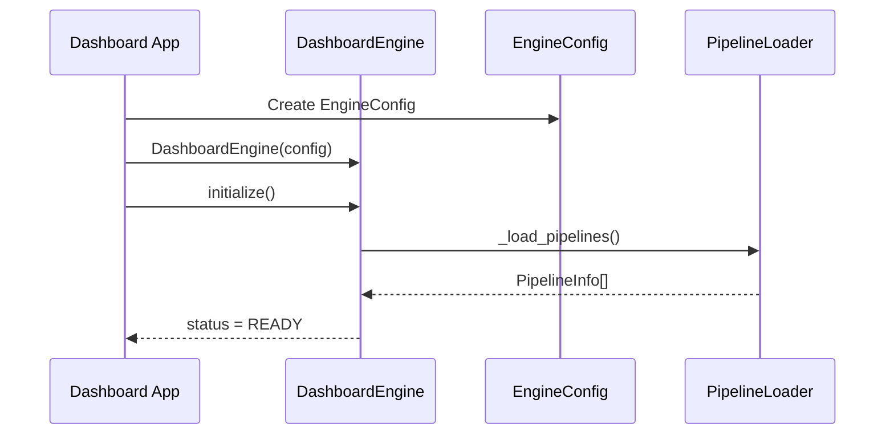
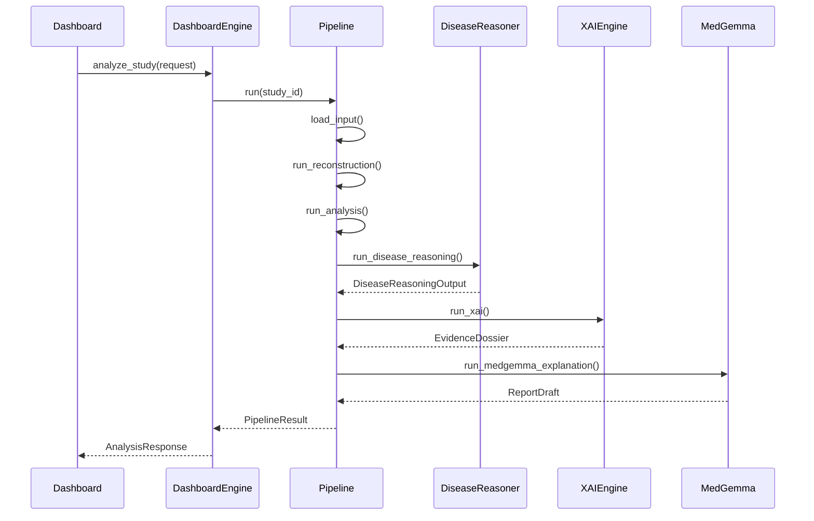
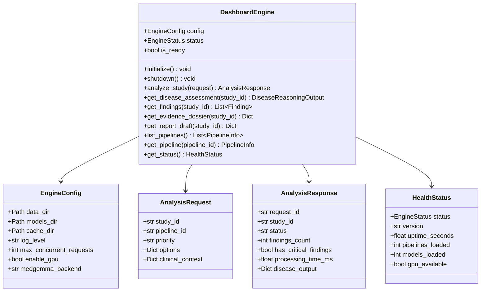
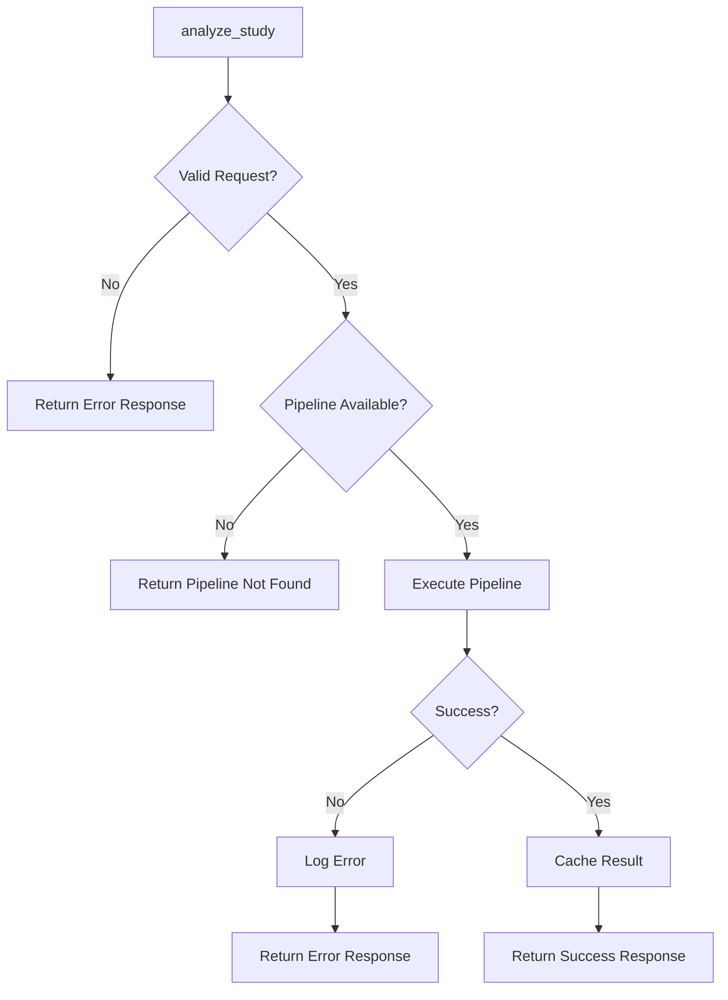

# Dashboard Engine API Reference

This document provides API documentation for the Rhenium OS Dashboard Engine.

---

## Overview

The Dashboard Engine provides a unified API for dashboard applications to access all Rhenium OS capabilities.



---

## Engine Initialization



---

## Analysis Workflow



---

## API Reference

### DashboardEngine

Main engine class for dashboard integration.



---

## Usage Examples

### Basic Analysis

```python
from rhenium.engine import DashboardEngine, EngineConfig, AnalysisRequest

# Initialize engine
config = EngineConfig(enable_gpu=True)
engine = DashboardEngine(config)
engine.initialize()

# Check status
status = engine.get_status()
print(f"Engine status: {status.status.value}")
print(f"Pipelines loaded: {status.pipelines_loaded}")

# Analyze a study
request = AnalysisRequest(
    study_id="study_001",
    pipeline_id="ct_head_ich_detection",
    priority="urgent",
)
response = engine.analyze_study(request)

# Get disease assessment
disease = engine.get_disease_assessment("study_001")
if disease and disease.has_disease:
    print(f"Primary diagnosis: {disease.primary_diagnosis.disease_name}")
    if disease.has_critical_flags:
        print("CRITICAL: Requires immediate attention")

# Cleanup
engine.shutdown()
```

---

## Error Handling



---

## Configuration Options

| Option | Type | Default | Description |
|--------|------|---------|-------------|
| `data_dir` | Path | `./data` | Data storage directory |
| `models_dir` | Path | `./models` | Model weights directory |
| `cache_dir` | Path | `./cache` | Results cache directory |
| `log_level` | str | `INFO` | Logging level |
| `max_concurrent_requests` | int | `4` | Maximum parallel requests |
| `enable_gpu` | bool | `True` | Enable GPU acceleration |
| `medgemma_backend` | str | `stub` | MedGemma backend type |
| `enable_audit_logging` | bool | `True` | Enable audit logging |

---

**Copyright (c) 2025 Skolyn LLC. All rights reserved.**

