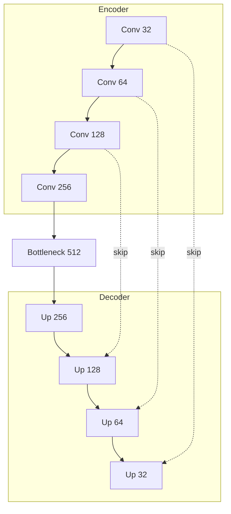

# Models API Reference

## Segmentation

### UNet3D

3D U-Net for volumetric segmentation.

```python
from rhenium.perception.segmentation import UNet3D

model = UNet3D(
    in_channels=1,
    out_channels=3,
    features=[32, 64, 128, 256],
    use_attention=True,
)
```

**Architecture:**



### UNETR

Transformer-based segmentation.

```python
from rhenium.perception.segmentation import UNETR

model = UNETR(
    in_channels=1,
    out_channels=2,
    img_size=(96, 96, 96),
    patch_size=16,
    embed_dim=768,
)
```

---

## Detection

### CenterNet3D

Anchor-free 3D detection.

```python
from rhenium.perception.detection import CenterNet3D

model = CenterNet3D(
    in_channels=1,
    num_classes=1,  # e.g., nodule detection
)

# Decode detections
outputs = model(tensor)
detections = model.decode_detections(outputs, threshold=0.3)
```

| Output | Shape | Description |
|--------|-------|-------------|
| `heatmap` | (B, C, D', H', W') | Class probability at each location |
| `size` | (B, 3, D', H', W') | Predicted box dimensions |
| `offset` | (B, 3, D', H', W') | Sub-voxel offset |

---

## Classification

### ResNet3D

```python
from rhenium.perception.classification import ResNet3D

model = ResNet3D(
    in_channels=1,
    num_classes=5,  # e.g., PI-RADS grading
)

probs = model.predict_proba(tensor)
```

### OrdinalClassifier

For ordered class predictions (grading scales):

```python
from rhenium.perception.classification import OrdinalClassifier, ResNet3D

backbone = ResNet3D(in_channels=1, num_classes=512)
model = OrdinalClassifier(backbone, num_grades=5)
```

---

## Model Loading

```python
from rhenium.perception.segmentation import load_segmentation_model

model = load_segmentation_model(
    "unet3d",
    checkpoint="path/to/weights.pt",
    device="cuda",
)
```
