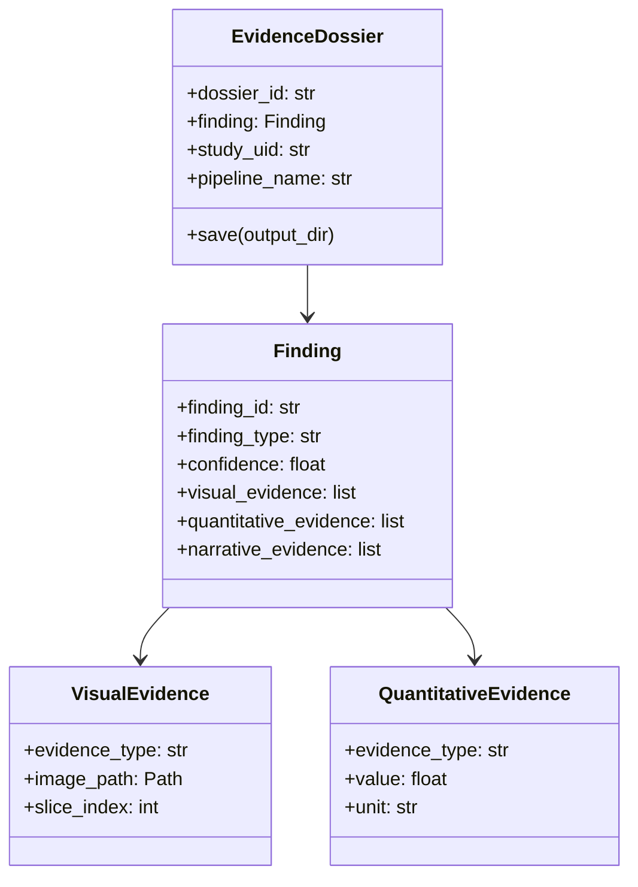

# XAI API Reference

## Evidence Dossier

The Evidence Dossier packages all supporting evidence for an AI finding.



### Creating a Dossier

```python
from rhenium.xai import EvidenceDossier, Finding, QuantitativeEvidence

# Create finding with evidence
finding = Finding(
    finding_id="lesion_001",
    finding_type="brain_lesion",
    description="T2-hyperintense lesion in left frontal lobe",
    confidence=0.92,
    severity=Severity.MEDIUM,
    quantitative_evidence=[
        QuantitativeEvidence("volume", 1250.0, "mm³"),
        QuantitativeEvidence("diameter", 15.2, "mm"),
    ],
)

# Package in dossier
dossier = EvidenceDossier(
    dossier_id="d001",
    finding=finding,
    study_uid="1.2.840.10008.5.1.4.1.1.2",
    series_uid="1.2.840.10008.5.1.4.1.1.2.1",
    pipeline_name="brain_lesion_v1",
    pipeline_version="1.0.0",
)

# Save
dossier.save(Path("./output"))
```

---

## Saliency Maps

### Gradient-based Saliency

```python
from rhenium.xai.saliency import SaliencyGenerator

generator = SaliencyGenerator(
    model=segmentation_model,
    target_layer="layer4",
)

saliency = generator.generate(
    input_tensor,
    target_class=1,
    method="gradcam",  # or "gradient"
)
```

### Methods

| Method | Description |
|--------|-------------|
| `gradient` | Vanilla gradient magnitude |
| `gradcam` | Gradient-weighted Class Activation Mapping |

---

## Measurements

```python
from rhenium.xai.measurements import MeasurementExtractor

extractor = MeasurementExtractor()

# Volume measurement
vol = extractor.extract_volume(mask, spacing=(1, 1, 1))
# Returns: QuantitativeEvidence(evidence_type="volume", value=1234.5, unit="mm³")

# Maximum diameter
diam = extractor.extract_max_diameter(mask, spacing=(1, 1, 1))
```

---

## Narrative Generation

```python
from rhenium.xai.narrative import NarrativeGenerator, NarrativeConfig

generator = NarrativeGenerator(
    medgemma_client=None,  # Use template-based
    config=NarrativeConfig(include_limitations=True),
)

narrative = generator.generate(finding)
# Returns NarrativeEvidence with explanation text
```
