# Architecture Overview: Skolyn Rhenium OS

**
---

## Introduction

This document provides a comprehensive overview of the Skolyn Rhenium OS architecture. Rhenium OS is a state-of-the-art, layered, modular system built on proprietary deep learning models, including Physics-Informed Neural Networks (PINNs), Generative Adversarial Networks (GANs), U-Net architectures, Vision Transformers, and 3D CNNs, that orchestrates the complete medical imaging AI pipeline from data ingestion through clinical reporting with unprecedented speed, accuracy, and transparency.

---

## High-Level Architecture

```mermaid
graph TD
    subgraph UI["User Interfaces"]
        CLI[Rhenium CLI]
        API[Python API]
        Future[Future: REST API]
    end
    
    subgraph Orchestration["Pipeline Orchestration"]
        Pipe[Configuration-Driven Pipelines]
        Log[Step Logging]
        Sched[Scheduling]
    end
    
    subgraph Reasoning["Reasoning and Explanation"]
        MG[MedGemma Adapter]
        Tools[Tool-Use Framework]
    end
    
    subgraph XAI["Explainability Layer"]
        Visual[Visual Evidence]
        Quant[Quantitative Evidence]
        Narr[Narrative Evidence]
    end
    
    subgraph Perception["Perception Layer"]
        Seg[Segmentation]
        Det[Detection]
        Class[Classification]
        Organ[Organ Modules]
        Gen[Generative Models]
    end
    
    subgraph Reconstruction["Reconstruction Layer"]
        MRI[MRI k-space]
        CT[CT Sinogram]
        XR[X-ray/US]
        PINN[PINNs]
    end
    
    subgraph Data["Data Layer"]
        DICOM[DICOM IO]
        NIFTI[NIfTI IO]
        RAW[Raw IO]
        Preproc[Preprocessing]
        Meta[Metadata & Lineage]
    end
    
    subgraph Core["Core Layer"]
        Config[Config]
        Logging[Logging]
        Errors[Errors]
        Registry[Registry]
    end
    
    subgraph Governance["Governance & Evaluation"]
        Audit[Audit Log]
        Cards[Model Cards]
        Fair[Fairness Metrics]
        Bench[Benchmarks]
    end
    
    UI --> Orchestration
    Orchestration --> Reasoning
    Reasoning --> XAI
    XAI --> Perception
    Perception --> Reconstruction
    Reconstruction --> Data
    Data --> Core
    Core --> Governance
```



---

## Layer Descriptions

### Core Layer

The foundation of Rhenium OS, providing:

- **Configuration**: Pydantic-based settings with environment variable support
- **Logging**: Structured logging with PHI sanitization
- **Errors**: Hierarchical, audit-friendly error system
- **Registry**: Version-aware component registration and discovery

### Data Layer

Handles all data ingestion and preprocessing:

- **DICOM IO**: Study/series loading, metadata extraction, patient ID hashing
- **NIfTI IO**: Research format support with orientation handling
- **Raw IO**: K-space (MRI), sinogram (CT), RF (Ultrasound) interfaces
- **Preprocessing**: Normalization, resampling, cropping
- **Metadata**: Lineage tracking, de-identification status

### Reconstruction Layer

Transforms raw acquisition data into diagnostic images:

- **MRI**: IFFT baseline, deep learning, Rhenium Reconstruction Engine
- **CT**: FBP, iterative, artifact correction
- **X-ray/US**: Enhancement and beamforming
- **PINNs**: Physics-constrained reconstruction

### Perception Layer

Extracts clinical findings from images:

- **Segmentation**: Anatomical and pathological structure delineation
- **Detection**: Localization of abnormalities with confidence
- **Classification**: Categorization and grading of findings
- **Organ Modules**: Specialized pipelines per organ system
- **Generative**: Super-resolution, denoising, anomaly detection

### Explainability Layer

Creates comprehensive evidence for all findings:

- **Visual**: Saliency maps, overlays, attention visualization
- **Quantitative**: Measurements, radiomics, uncertainty
- **Narrative**: Textual descriptions and reasoning

### Reasoning Layer

Integrates AI reasoning for clinical context:

- **MedGemma Adapter**: Report generation, explanation, validation
- **Tool-Use Framework**: Guideline checking, rule-based validation

### Pipeline Orchestration

Composes and executes end-to-end workflows:

- **Configuration-driven**: YAML-based pipeline definitions
- **Step logging**: Complete audit trail
- **Error handling**: Graceful degradation with detailed reporting

### Governance and Evaluation

Ensures quality, fairness, and compliance:

- **Audit Logging**: Regulatory-compliant activity recording
- **Model Cards**: Standardized model documentation
- **Fairness Metrics**: Stratified performance analysis
- **Benchmarks**: Standardized evaluation suites

---

## Data Flow

### Typical Pipeline Execution

```
1. INGEST
   - Load DICOM/NIfTI/Raw data
   - Extract and validate metadata
   - Apply preprocessing

2. RECONSTRUCT (if applicable)
   - Transform raw data to image domain
   - Apply enhancement or acceleration

3. ANALYZE
   - Run perception models
   - Generate segmentations, detections, classifications
   - Compute quantitative measurements

4. EXPLAIN
   - Generate visual evidence (saliency, overlays)
   - Compile quantitative evidence
   - Create Evidence Dossiers

5. REASON (MedGemma)
   - Generate narrative explanations
   - Draft structured report sections
   - Validate consistency

6. OUTPUT
   - Serialize results (JSON, DICOM-SR)
   - Log audit entry
   - Return PipelineResult
```

---

## Cross-Cutting Concerns

### Security and Privacy

- PHI sanitization in all logging
- Patient ID hashing for pseudonymization
- Access control hooks for deployment
- Audit trails for regulatory compliance

### Performance and Scalability

- GPU acceleration for inference
- Batch processing support
- Lazy loading for large datasets
- Caching for repeated operations

### Extensibility

- Plugin architecture via registry
- Version-aware component management
- Abstract base classes for all model types
- Configuration-driven behavior modification

---

## Integration Points

### Current Interfaces

| Interface | Access Method |
|-----------|---------------|
| Python API | Direct import of `rhenium` package |
| CLI | `rhenium` command with subcommands |
| Configuration | YAML files and environment variables |

### Future Integration (Not Implemented)

- REST API (to be wrapped around Python API)
- DICOM Worklist integration
- PACS storage/retrieval
- HL7/FHIR messaging

---

## Related Documentation

- [Core Architecture](core-architecture.md): Package structure and patterns
- [Pipeline Architecture](pipeline-architecture.md): Orchestration details
- [XAI Architecture](xai-architecture.md): Explainability framework
- [MedGemma Integration](medgemma-integration.md): Reasoning layer design

---

**Copyright (c) 2025 Skolyn LLC. All rights reserved.**

****
