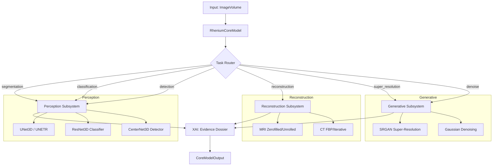

# RheniumCoreModel Architecture

This document describes the unified core model architecture for the Rhenium OS platform.

> **IMPORTANT**: This is a research and development system. It is NOT intended for clinical use and makes NO claims of clinical performance or regulatory compliance.

## Overview

`RheniumCoreModel` provides a single entrypoint for medical imaging AI tasks, integrating four major subsystems:



## API Reference

### Configuration

```python
from rhenium.models import RheniumCoreModelConfig

config = RheniumCoreModelConfig(
    device="cpu",           # or "cuda"
    seed=42,                # reproducibility seed
    deterministic=True,     # enable deterministic ops
    perception_enabled=True,
    reconstruction_enabled=True,
    generative_enabled=True,
    xai_enabled=True,
    segmentation_model="unet3d",
    segmentation_features=[16, 32, 64, 128],
    segmentation_classes=2,
    reconstruction_model="mri_zerofilled",
    generator_model="srgan",
    generator_features=32,
    dtype="float32",
)
```

### Initialization and Running

```python
from rhenium.models import RheniumCoreModel, TaskType
from rhenium.testing.synthetic import SyntheticDataGenerator

# Create and initialize
model = RheniumCoreModel(config)
model.initialize()

# Generate synthetic data
generator = SyntheticDataGenerator(seed=42)
volume = generator.generate_volume(shape=(64, 128, 128), modality="MRI")

# Run task
result = model.run(volume, task=TaskType.SEGMENTATION)
print(result.output.shape)  # Segmentation mask
print(result.evidence_dossier)  # XAI dossier
```

### Supported Tasks

| Task | Description | Output |
|------|-------------|--------|
| `SEGMENTATION` | 3D volumetric segmentation | Integer mask |
| `CLASSIFICATION` | Volume-level classification | Class index |
| `DETECTION` | Object/lesion detection | Bounding boxes |
| `RECONSTRUCTION` | MRI/CT image reconstruction | Reconstructed image |
| `SUPER_RESOLUTION` | Image upscaling | High-res image |
| `DENOISE` | Noise reduction | Denoised image |
| `FULL_PIPELINE` | Complete analysis pipeline | Mask + metrics |

## Output Structure

### CoreModelOutput

```python
@dataclass
class CoreModelOutput:
    task: TaskType                      # Task performed
    output: np.ndarray | torch.Tensor   # Primary output
    evidence_dossier: dict | None       # XAI evidence package
    generation_metadata: dict | None    # For generative outputs
    provenance: dict                    # Audit trail metadata
    metrics: dict                       # Computed metrics
    raw_outputs: dict                   # Additional outputs
```

### Evidence Dossier Structure

```json
{
  "dossier_id": "abc12345",
  "finding": {
    "id": "seg_abc12345",
    "type": "segmentation_mask",
    "description": "Automated segmentation result",
    "confidence": 0.85,
    "quantitative": [...],
    "narrative": [...]
  },
  "study_uid": "1.2.3.4.5",
  "pipeline": "RheniumCoreModel:1.0.0",
  "created_at": "2025-01-01T00:00:00"
}
```

### Generation Metadata (for AI-generated content)

```json
{
  "generated_at": "2025-01-01T00:00:00",
  "generator": "RheniumCoreModel:1.0.0",
  "input_hash": "a1b2c3d4e5f6",
  "parameters": {"task": "super_resolution", "device": "cpu"},
  "disclosure": "This image was generated by AI and is for research purposes only"
}
```

## Reproducibility

The model supports deterministic execution via:

1. **Fixed seed**: Set `seed` in config
2. **Deterministic flag**: Set `deterministic=True`
3. **Reset method**: Call `model.reset()` between runs

```python
# Two runs with same seed produce identical outputs
config = RheniumCoreModelConfig(seed=42, deterministic=True)
model = RheniumCoreModel(config)
model.initialize()

result1 = model.run(volume, task=TaskType.SEGMENTATION)
model.reset()
result2 = model.run(volume, task=TaskType.SEGMENTATION)

np.testing.assert_array_equal(result1.output, result2.output)
```

## Limitations

- **Research Only**: Not validated for clinical use
- **Synthetic Testing**: Benchmarks use synthetic data only
- **No Large Weights**: Bundle includes minimal weight initialization only
- **CPU Default**: GPU acceleration available but not required
- **2D SR**: Super-resolution processes 2D slices, not full 3D volumes

## Integration with Existing Systems

### With RheniumKernel

```python
from rhenium.core.kernel import get_kernel
from rhenium.models import RheniumCoreModel, RheniumCoreModelConfig

# Core model can be used standalone or via kernel
kernel = get_kernel()
kernel.initialize()

# Or use directly
model = RheniumCoreModel(RheniumCoreModelConfig())
model.initialize()
```

### With Pipelines

```python
from rhenium.pipelines.base import Pipeline, PipelineConfig

class CoreModelPipeline(Pipeline):
    def __init__(self, config: PipelineConfig):
        super().__init__(config)
        self.core_model = RheniumCoreModel(RheniumCoreModelConfig())
        self.core_model.initialize()

    def run(self, volume, **kwargs):
        return self.core_model.run(volume, task="full_pipeline")
```
