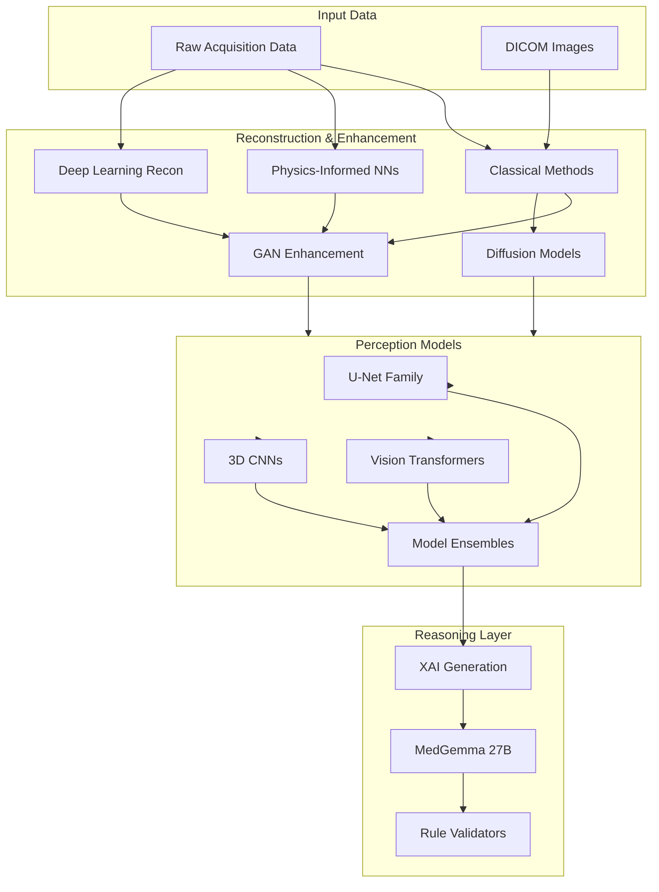
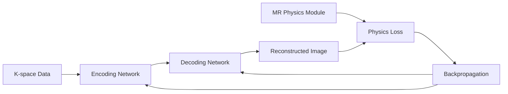
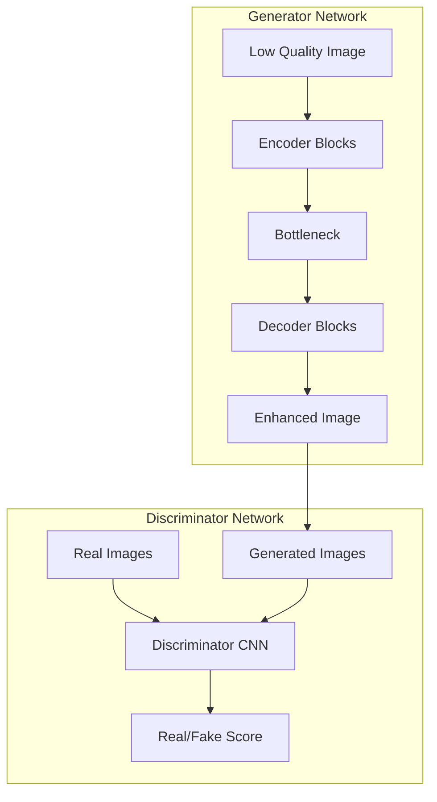
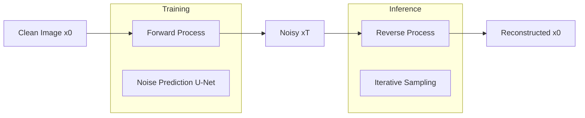
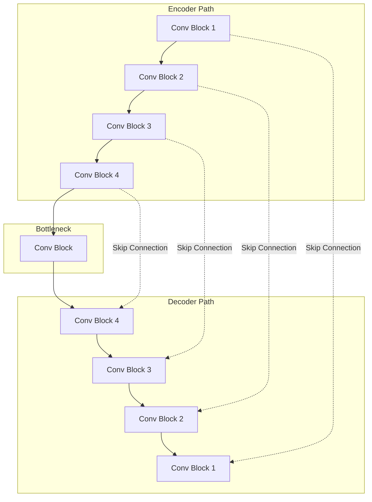
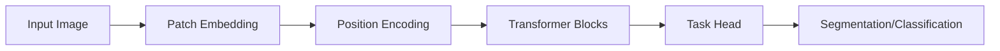
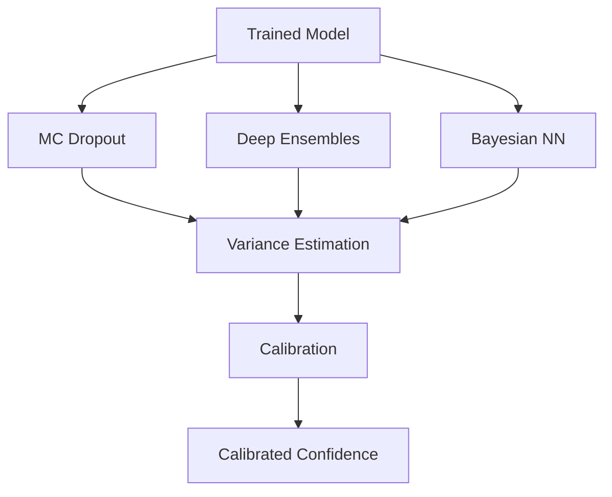
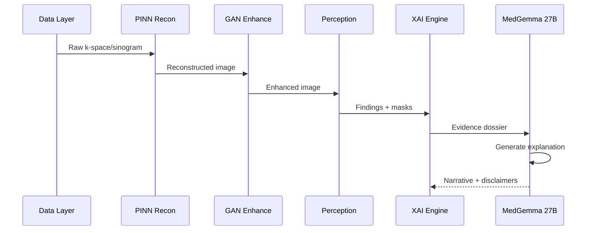

# Generative Models and Physics-Informed Neural Networks Architecture

**
---

## Overview

Rhenium OS integrates a comprehensive ecosystem of generative and physics-informed models for image reconstruction, enhancement, and augmentation. These models complement traditional methods and the perception/reasoning layers.

---

## Model Ecosystem Diagram

---

## Physics-Informed Neural Networks (PINNs)

### Concept

PINNs embed physical laws into neural network training, ensuring outputs respect known physics:

$$\mathcal{L}_{\text{total}} = \mathcal{L}_{\text{data}} + \lambda_{\text{phys}} \mathcal{L}_{\text{physics}} + \lambda_{\text{reg}} \mathcal{L}_{\text{reg}}$$

Where:
- $\mathcal{L}_{\text{data}}$: Data fidelity term (MSE between prediction and measurements)
- $\mathcal{L}_{\text{physics}}$: Physics constraint term (PDE residual)
- $\mathcal{L}_{\text{reg}}$: Regularization term

### MRI PINNs

**Signal Equation Constraint:**

$$S(TR, TE) = \rho \cdot e^{-TE/T_2} \cdot (1 - e^{-TR/T_1})$$

**Applications:**
- Undersampled k-space reconstruction
- T1/T2 mapping from limited acquisitions
- Multi-contrast synthesis

### CT PINNs

**Forward Model Constraint:**

$$p = \int_L \mu(x, y) \, dl$$

Where $p$ is the projection measurement and $\mu$ is the attenuation coefficient.

**Applications:**
- Low-dose CT denoising
- Limited-angle reconstruction
- Metal artifact reduction

### Ultrasound PINNs

**Wave Propagation Constraint:**

$$\nabla^2 p - \frac{1}{c^2} \frac{\partial^2 p}{\partial t^2} = 0$$

**Applications:**
- Speed-of-sound reconstruction
- Aberration correction
- Quantitative ultrasound

---

## Generative Models

### GAN Architectures

#### Super-Resolution GAN

| Component | Architecture |
|-----------|-------------|
| Generator | RRDB (Residual-in-Residual Dense Block) |
| Discriminator | VGG-style with spectral normalization |
| Loss | L1 + Perceptual + Adversarial |
| Scale factors | 2x, 4x |

#### Denoising GAN

| Component | Architecture |
|-----------|-------------|
| Generator | U-Net with attention |
| Discriminator | PatchGAN |
| Loss | L1 + SSIM + Adversarial |
| Applications | Low-dose CT, fast MRI |

### Diffusion Models

**Forward Process:**
$$q(x_t | x_{t-1}) = \mathcal{N}(x_t; \sqrt{1-\beta_t} x_{t-1}, \beta_t I)$$

**Reverse Process:**
$$p_\theta(x_{t-1} | x_t) = \mathcal{N}(x_{t-1}; \mu_\theta(x_t, t), \Sigma_\theta(x_t, t))$$

**Applications:**
- Training data augmentation (synthetic data generation)
- Image inpainting for artifact removal
- Conditional generation for protocol transfer

---

## Perception Model Architectures

### U-Net Family

| Variant | Key Features | Use Case |
|---------|--------------|----------|
| U-Net | Standard encoder-decoder | 2D segmentation |
| U-Net++ | Dense skip connections | Multi-scale features |
| nnU-Net | Auto-configured | Self-adapting |
| 3D U-Net | Volumetric convolutions | 3D segmentation |
| Attention U-Net | Attention gates | Focused regions |

### Vision Transformers

| Architecture | Key Features | Parameters |
|--------------|--------------|------------|
| ViT | Pure transformer | 86M - 632M |
| Swin Transformer | Shifted windows | 29M - 197M |
| UNETR | U-Net + Transformers | ~93M |
| TransUNet | Hybrid CNN-Transformer | ~105M |

### 3D CNNs

**Architecture Options:**

| Model | Convolution Type | Memory | Accuracy |
|-------|------------------|--------|----------|
| 3D U-Net | Full 3D | High | Excellent |
| 2.5D (Multi-slice) | 2D on stacked | Medium | Good |
| Pseudo-3D | Factorized 3D | Low | Good |
| V-Net | Volumetric | High | Excellent |

---

## Uncertainty Quantification

### Methods

| Method | Description | Overhead |
|--------|-------------|----------|
| MC Dropout | Multiple forward passes with dropout | 10-50x inference |
| Deep Ensembles | Train multiple models | 3-10 models |
| Temperature Scaling | Post-hoc calibration | Negligible |
| Bayesian Layers | Variational inference | 2x parameters |

### Calibration Metrics

**Expected Calibration Error (ECE):**

$$\text{ECE} = \sum_{m=1}^{M} \frac{|B_m|}{n} |acc(B_m) - conf(B_m)|$$

---

## Safety Considerations

### Generative Model Risks

| Risk | Mitigation |
|------|------------|
| Hallucination of anatomy | Structural consistency checks |
| Over-smoothing pathology | Lesion-aware loss functions |
| Distribution shift | Continuous OOD monitoring |
| Synthetic data confusion | Mandatory synthetic labels |

### Clinical Safeguards

1. **Traceability**: All generative outputs logged with model version
2. **Labeling**: Synthetic/enhanced data clearly marked in metadata
3. **Validation**: Separate clinical validation on held-out data
4. **Human Review**: High-risk cases flagged for radiologist review

---

## Integration with Rhenium OS

---

**Copyright (c) 2025 Skolyn LLC. All rights reserved.**

**SPDX-License-Identifier: EUPL-1.1**
