# Mermaid Diagrams Reference

**
---

## Overview

This document provides a centralized reference for all major architectural diagrams in Rhenium OS using Mermaid syntax.

---

## 1. Global System Architecture

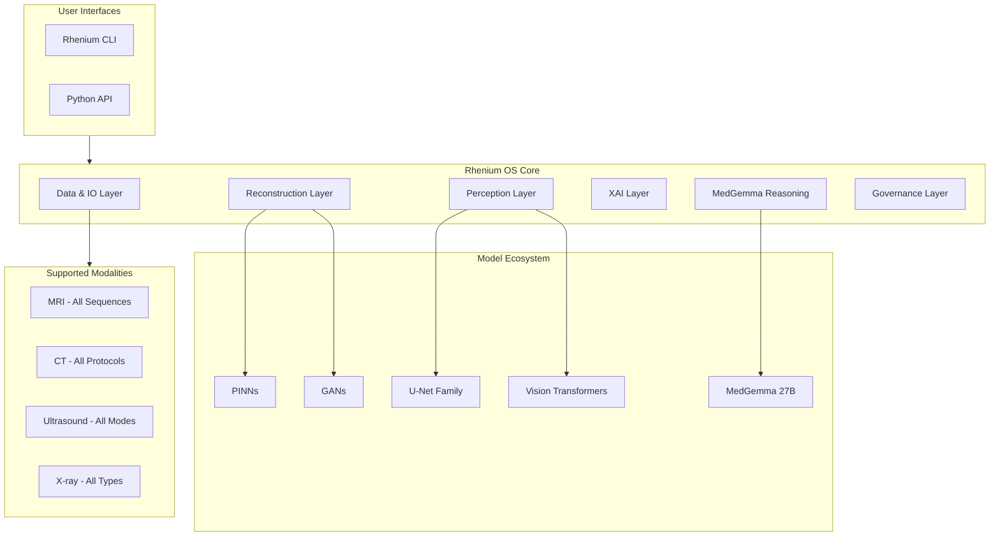

---

## 2. Data Flow Pipeline

```mermaid
flowchart LR
    subgraph Ingest["1. Data Ingestion"]
        DICOM[DICOM Files]
        RAW[Raw Data]
        META[Metadata]
    end
    
    subgraph Preprocess["2. Preprocessing"]
        Norm[Normalization]
        Reg[Registration]
        QC[Quality Check]
    end
    
    subgraph Recon["3. Reconstruction"]
        Phys[Physics-Informed]
        DL[Deep Learning]
        Enh[Enhancement]
    end
    
    subgraph Analyze["4. Analysis"]
        Seg[Segmentation]
        Det[Detection]
        Cls[Classification]
        Quant[Quantification]
    end
    
    subgraph Explain["5. Explanation"]
        Vis[Visual XAI]
        Num[Quantitative XAI]
        Narr[Narrative XAI]
    end
    
    subgraph Report["6. Reporting"]
        Dossier[Evidence Dossier]
        MG[MedGemma Report]
        Audit[Audit Log]
    end
    
    Ingest --> Preprocess --> Recon --> Analyze --> Explain --> Report
```

---

## 3. MRI Processing Flow

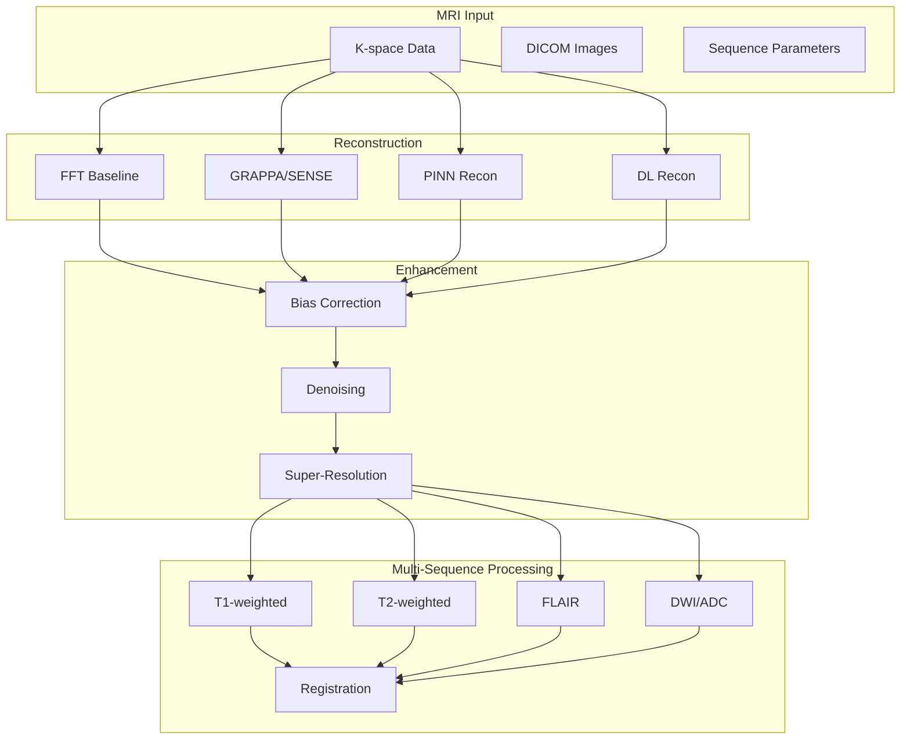

---

## 4. CT Processing Flow

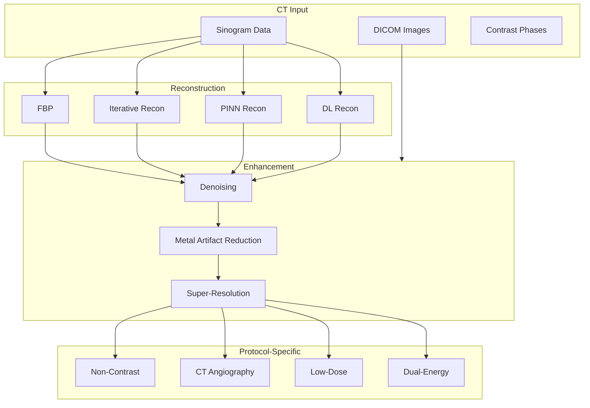

---

## 5. Ultrasound Processing Flow

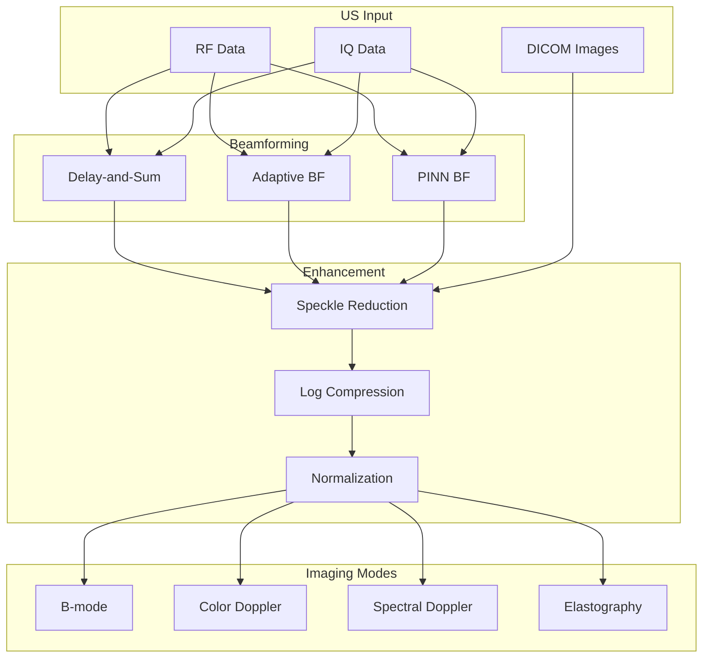

---

## 6. X-ray Processing Flow

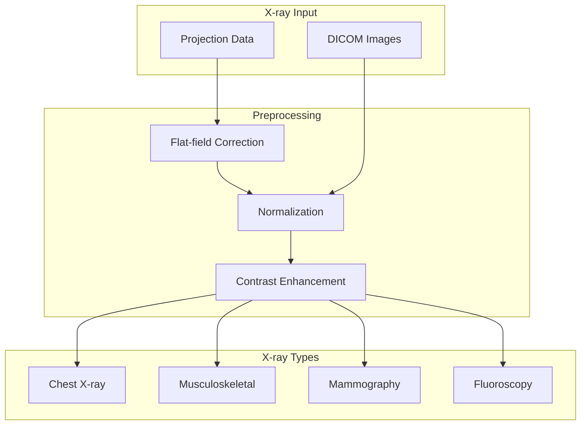

---

## 7. Perception Model Architecture

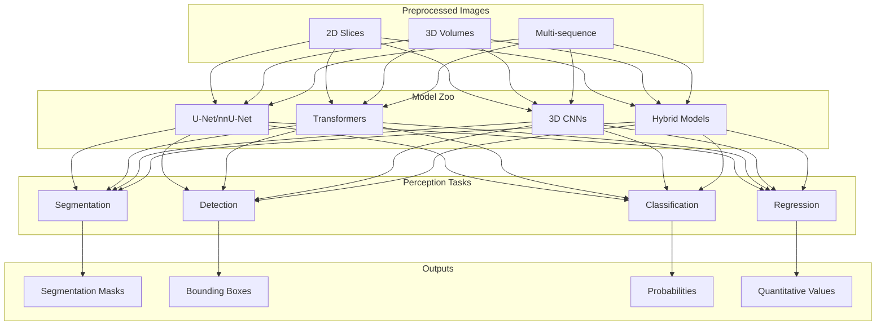

---

## 8. XAI and Evidence Dossier Flow

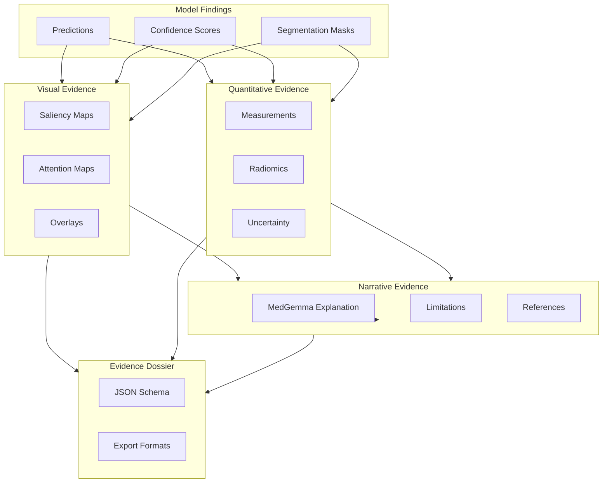

---

## 9. MedGemma Integration

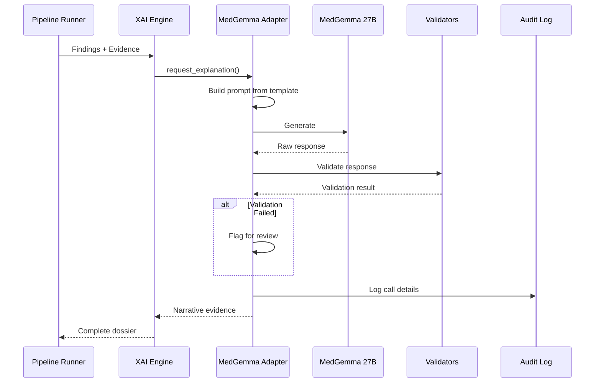

---

## 10. Governance and Audit Flow

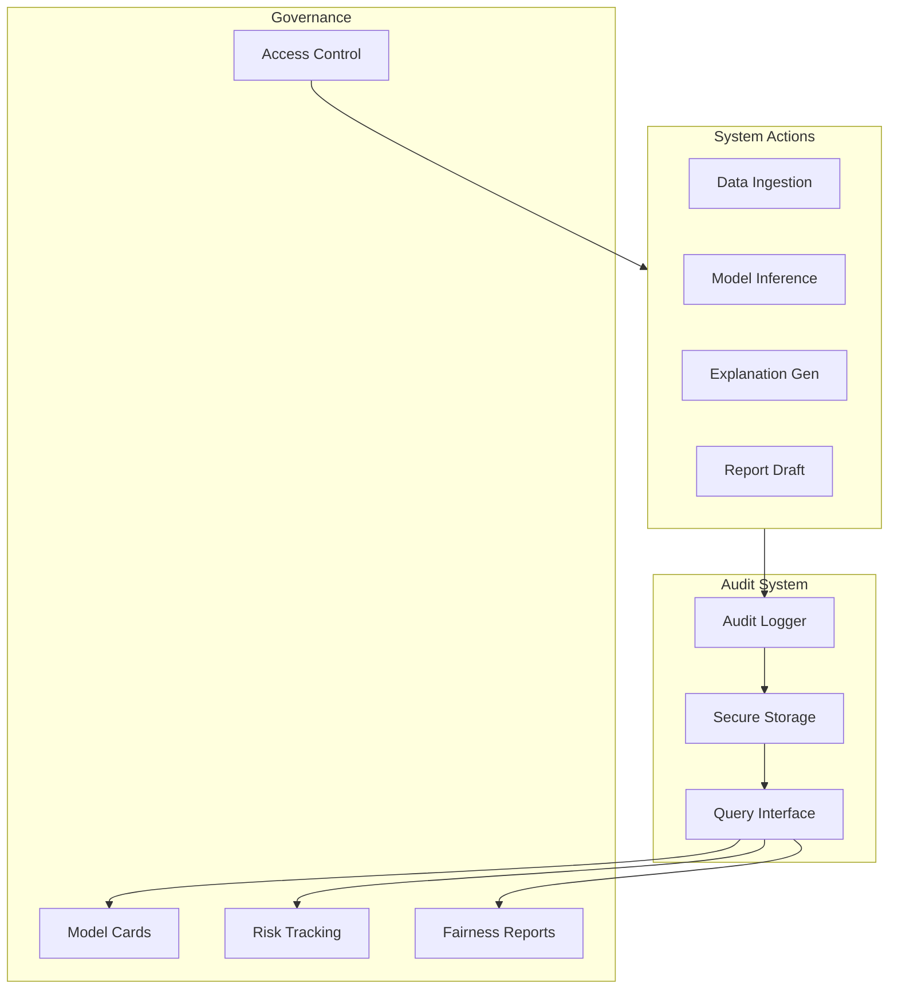

---

## 11. Fairness Evaluation Flow

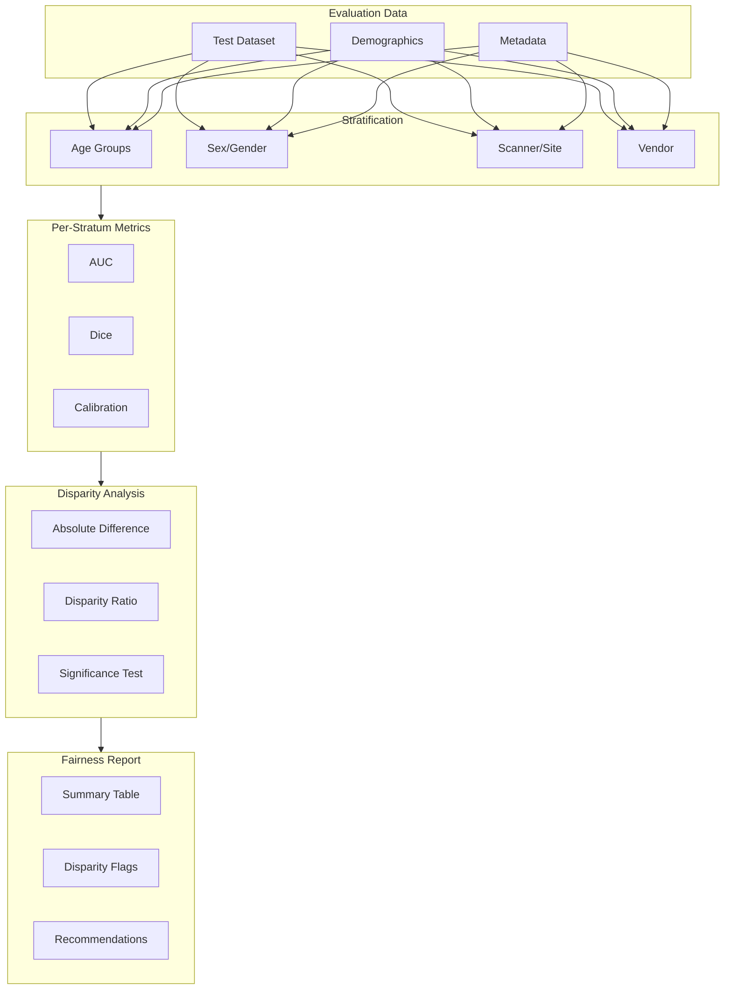

---

**Copyright (c) 2025 Skolyn LLC. All rights reserved.**

**SPDX-License-Identifier: EUPL-1.1**
