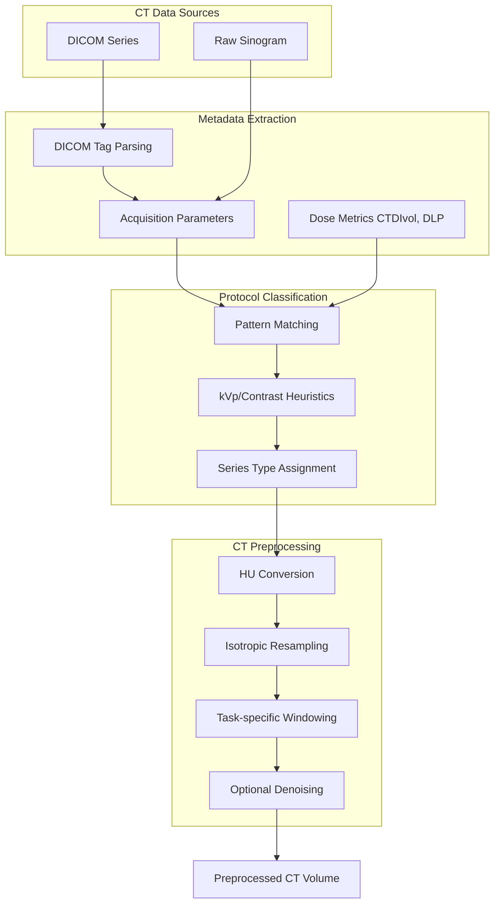
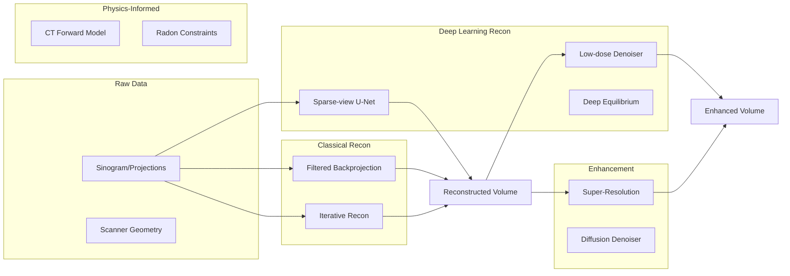
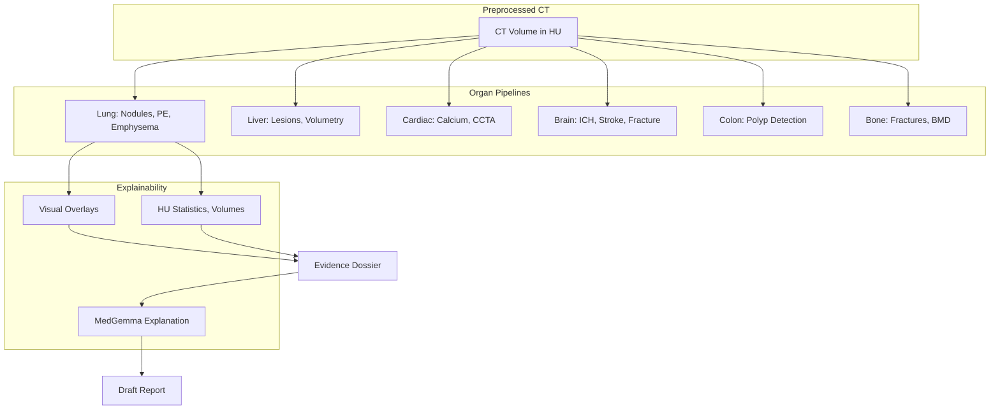

# CT Modality Architecture

**
****

---

## Overview

This document describes the comprehensive CT subsystem within Rhenium OS, covering all major CT protocol types, reconstruction methods, perception pipelines, and explainability features.

---

## Supported CT Protocol Types

### Non-Contrast CT

| Protocol | Description | Clinical Applications |
|----------|-------------|----------------------|
| Head CT | Non-contrast brain imaging | Stroke, trauma, hemorrhage |
| Chest CT | Lung parenchyma evaluation | Nodules, ILD, emphysema |
| Abdomen/Pelvis CT | Solid organ evaluation | Stones, obstruction |
| Spine CT | Vertebral imaging | Fractures, degenerative |
| Extremity CT | Bone and joint detail | Trauma, arthritis |

### Contrast-Enhanced CT

| Phase | Timing | Clinical Applications |
|-------|--------|----------------------|
| Arterial | 25-35s post-injection | Hypervascular lesions, CTA |
| Portal Venous | 60-70s post-injection | Liver lesions, staging |
| Delayed | 3-5 min post-injection | Urothelial tumors, fibrosis |
| Nephrogenic | 90-120s post-injection | Renal evaluation |

### CT Angiography (CTA)

| Protocol | Anatomy | Clinical Applications |
|----------|---------|----------------------|
| CTA Head/Neck | Carotid, Circle of Willis | Stroke, aneurysm |
| CTA Pulmonary | Pulmonary arteries | PE detection |
| CTA Coronary | Coronary arteries | CAD evaluation |
| CTA Aorta | Thoracic/abdominal aorta | Aneurysm, dissection |
| CTA Runoff | Lower extremity vessels | PAD evaluation |

### CT Perfusion (CTP)

| Protocol | Description | Clinical Applications |
|----------|-------------|----------------------|
| Brain CTP | Cerebral perfusion mapping | Acute stroke core/penumbra |
| Cardiac CTP | Myocardial perfusion | Ischemia detection |
| Liver CTP | Hepatic perfusion | Tumor vascularity |

### Dual-Energy / Spectral CT

| Acquisition | Output | Clinical Applications |
|-------------|--------|----------------------|
| Dual-source CT | Material maps | Gout, kidney stones |
| Rapid kVp switching | Virtual monoenergetic | Metal artifact reduction |
| Photon-counting | High-resolution spectral | Research, cardiac |

### Cardiac CT

| Protocol | Description | Clinical Applications |
|----------|-------------|----------------------|
| Calcium Score | Non-contrast, ECG-gated | CAD risk stratification |
| CCTA | Contrast, ECG-gated | Coronary stenosis |
| Cardiac Function | Retrospective recon | EF, wall motion |

### Special Protocols

| Protocol | Description | Clinical Applications |
|----------|-------------|----------------------|
| CT Colonography | Insufflated colon | Polyp screening |
| Temporal Bone | High-resolution bone | Otologic disease |
| Dental CBCT | Cone-beam | Implant planning |

---

## CT Data Ingestion Pipeline

---

## CT Reconstruction Architecture

---

## CT Physics

### Beer-Lambert Law

$$I = I_0 \cdot e^{-\mu L}$$

Where:
- $I_0$ = Incident X-ray intensity
- $I$ = Transmitted intensity
- $\mu$ = Linear attenuation coefficient (1/cm)
- $L$ = Path length (cm)

### Hounsfield Unit Conversion

$$HU = 1000 \times \frac{\mu - \mu_{water}}{\mu_{water}}$$

Standard HU values:
- Air: -1000 HU
- Water: 0 HU
- Soft tissue: 20-80 HU
- Bone: 400-1000 HU

### Radon Transform

$$p(\theta, s) = \int_{-\infty}^{\infty} f(s\cos\theta - t\sin\theta, s\sin\theta + t\cos\theta) dt$$

The CT forward model represents line integrals of attenuation.

---

## CT Perception Pipeline

---

## Window Presets

| Preset | Center (HU) | Width (HU) | Use Case |
|--------|-------------|------------|----------|
| Lung | -600 | 1500 | Lung parenchyma |
| Soft Tissue | 40 | 400 | Abdomen, general |
| Bone | 400 | 1800 | Skeletal structures |
| Brain | 40 | 80 | Brain parenchyma |
| Stroke | 40 | 40 | Subtle parenchymal changes |
| Subdural | 75 | 215 | Extra-axial collections |
| Liver | 60 | 160 | Hepatic lesions |
| Angio | 300 | 600 | Vascular structures |

---

## CT Benchmark Targets

| Organ | Task | Metric | Target |
|-------|------|--------|--------|
| Brain | ICH detection | AUC | > 0.97 |
| Brain | Stroke detection | Sensitivity | > 0.90 |
| Lung | Nodule detection | Sens@1FP/case | > 0.92 |
| Lung | PE detection | AUC | > 0.95 |
| Liver | Lesion segmentation | Dice | > 0.86 |
| Heart | Calcium score | Correlation | > 0.95 |
| Heart | Coronary stenosis | AUC | > 0.90 |
| Colon | Polyp detection | AUC | > 0.93 |
| Bone | Fracture detection | Sensitivity | > 0.95 |

---

## Module Reference

| Module | Path | Description |
|--------|------|-------------|
| CT Data | `rhenium/data/modality_ct.py` | Series types, metadata, preprocessing |
| CT Recon | `rhenium/reconstruction/ct/` | FBP, DL, PINN reconstruction |
| CT PINNs | `rhenium/pinns/ct_pinns.py` | Physics-informed models |
| Lung Perception | `rhenium/perception/organ/lung/` | Nodule, PE, emphysema |
| Cardiac Perception | `rhenium/perception/organ/heart/` | Calcium, CCTA |
| Brain CT | `rhenium/perception/organ/brain/` | ICH, stroke |

---

**Copyright (c) 2025 Skolyn LLC. All rights reserved.**

****
