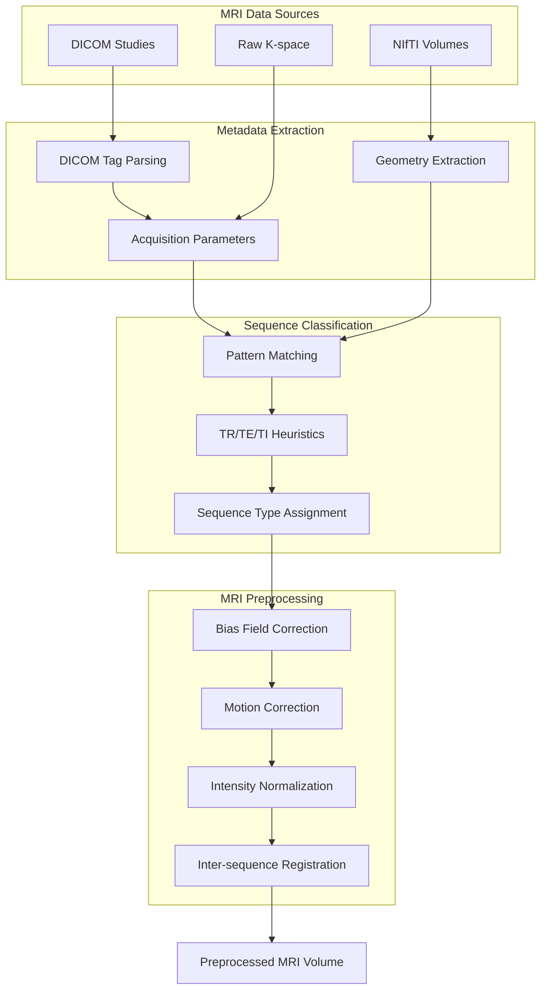
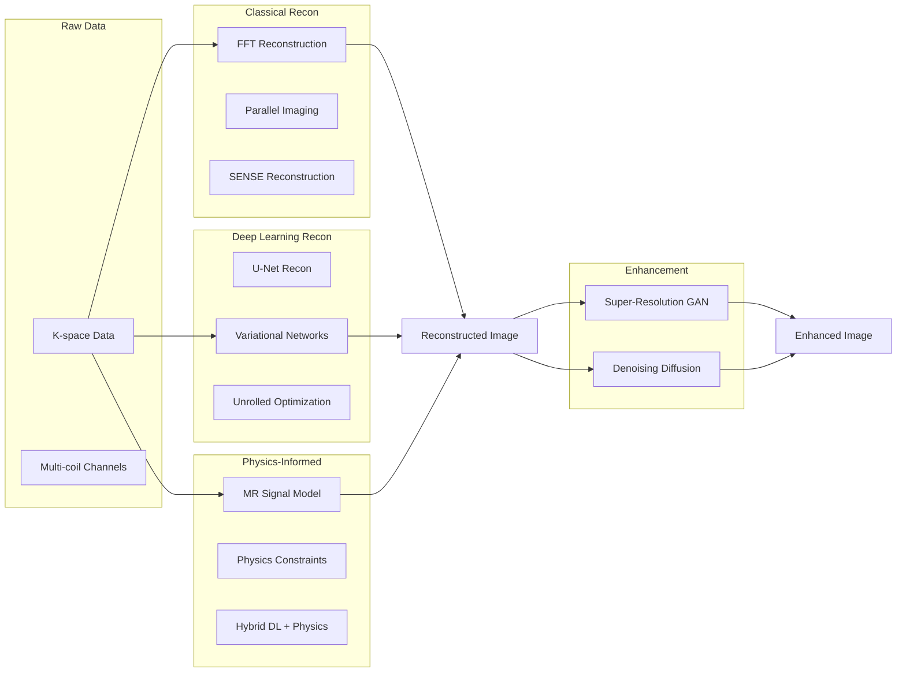
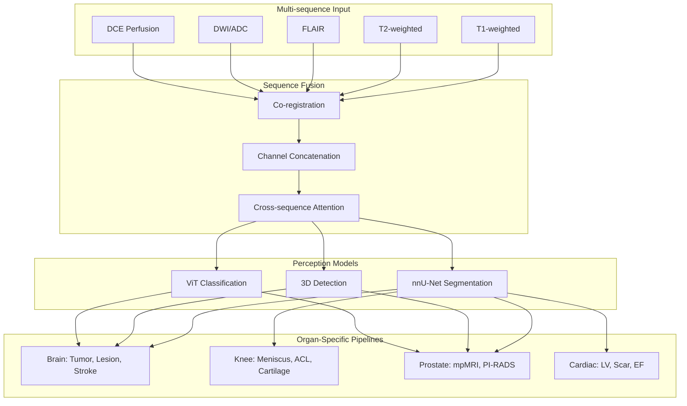
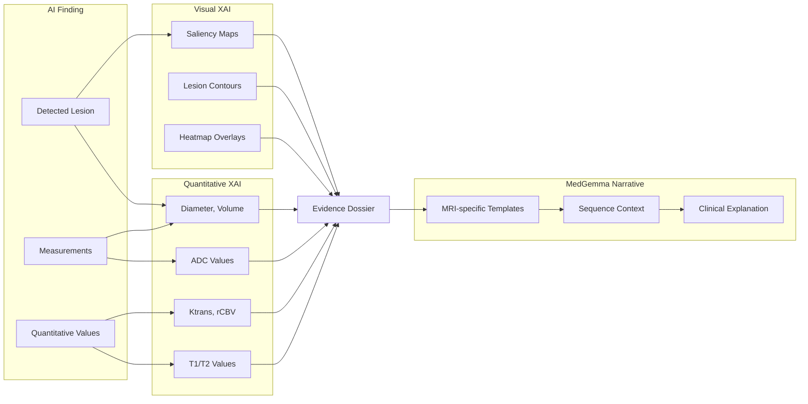

# MRI Modality Architecture

**
****

---

## Overview

This document describes the comprehensive MRI subsystem within Rhenium OS, covering all major MRI sequence types, reconstruction methods, perception pipelines, and explainability features.

---

## Supported MRI Sequence Types

### Structural MRI

| Sequence | Description | Clinical Applications |
|----------|-------------|----------------------|
| T1-weighted (SE/GRE) | Short TR, short TE; anatomical detail | Brain anatomy, lesion characterization |
| T1 MP-RAGE/SPGR | 3D volumetric T1; high resolution | Volumetry, atrophy quantification |
| T2-weighted (FSE/TSE) | Long TR, long TE; fluid-sensitive | Edema, inflammation, cysts |
| Proton Density (PD) | Long TR, short TE; tissue contrast | Meniscus, cartilage, ligaments |
| FLAIR | T2 with CSF suppression | White matter lesions, MS, stroke |
| STIR | Fat suppression; edema detection | Bone marrow edema, soft tissue |
| SWI/SWAN | Susceptibility-weighted | Microbleeds, iron, calcification |
| T2* | Gradient echo; hemorrhage sensitive | Blood products, hemosiderin |

### Diffusion MRI

| Sequence | Description | Clinical Applications |
|----------|-------------|----------------------|
| DWI | Diffusion-weighted imaging | Acute stroke, abscess, tumor cellularity |
| ADC Map | Apparent Diffusion Coefficient | Quantitative diffusion values |
| DTI | Diffusion tensor imaging | White matter tracts, fiber integrity |
| FA/MD Maps | Fractional anisotropy, mean diffusivity | Microstructural analysis |
| HARDI/NODDI | Advanced diffusion models | Complex fiber architecture |

### Perfusion and Dynamic MRI

| Sequence | Description | Clinical Applications |
|----------|-------------|----------------------|
| DSC | Dynamic susceptibility contrast | Cerebral blood volume, flow |
| DCE | Dynamic contrast enhanced | Tumor vascularity, permeability |
| ASL | Arterial spin labeling | Non-contrast perfusion |
| fMRI (BOLD) | Blood oxygen level dependent | Functional brain mapping |

### MR Angiography

| Sequence | Description | Clinical Applications |
|----------|-------------|----------------------|
| TOF-MRA | Time-of-flight | Intracranial vessels, Circle of Willis |
| PC-MRA | Phase-contrast | Flow quantification, velocity |
| CE-MRA | Contrast-enhanced | Carotid, peripheral vessels |
| MRV | MR venography | Venous sinus thrombosis |

### Quantitative MRI

| Sequence | Description | Clinical Applications |
|----------|-------------|----------------------|
| T1 Mapping (MOLLI) | Pixel-wise T1 values | Myocardial fibrosis, liver iron |
| T2 Mapping | Pixel-wise T2 values | Myocardial edema, cartilage |
| T2* Mapping | Pixel-wise T2* values | Iron overload quantification |
| QSM | Quantitative susceptibility | Iron, calcium quantification |

### Cardiac MRI

| Sequence | Description | Clinical Applications |
|----------|-------------|----------------------|
| Cine SSFP | Bright-blood cardiac motion | Ventricular function, EF |
| LGE | Late gadolinium enhancement | Myocardial scar, infarct |
| Phase-contrast | Flow velocity encoding | Valvular flow, shunts |
| Cardiac T1/T2 Map | Tissue characterization | Cardiomyopathy, edema |

### Spectroscopy

| Sequence | Description | Clinical Applications |
|----------|-------------|----------------------|
| MRS (Single-voxel) | Metabolite quantification | Tumor grading, metabolic disorders |
| MRSI (Multi-voxel) | Spatial metabolite mapping | Tumor margins, heterogeneity |

---

## MRI Data Ingestion Pipeline

---

## MRI Reconstruction Architecture

---

## MRI Signal Physics

### Spin Echo Signal Equation

$$S_{SE} = M_0 \cdot (1 - e^{-TR/T_1}) \cdot e^{-TE/T_2}$$

Where:
- $M_0$ = Equilibrium magnetization (proton density)
- $TR$ = Repetition time (ms)
- $TE$ = Echo time (ms)
- $T_1$ = Longitudinal relaxation time (ms)
- $T_2$ = Transverse relaxation time (ms)

### Gradient Echo Signal Equation

$$S_{GRE} = M_0 \cdot \frac{\sin(\alpha)(1 - e^{-TR/T_1})}{1 - \cos(\alpha) \cdot e^{-TR/T_1}} \cdot e^{-TE/T_2^*}$$

Where:
- $\alpha$ = Flip angle (radians)
- $T_2^*$ = Effective transverse relaxation time

### Inversion Recovery Signal

$$S_{IR} = M_0 \cdot |1 - 2 \cdot e^{-TI/T_1} + e^{-TR/T_1}|$$

Where:
- $TI$ = Inversion time (ms)

### Diffusion Signal

$$S_b = S_0 \cdot e^{-b \cdot ADC}$$

Where:
- $S_0$ = Signal at b=0
- $b$ = B-value (s/mm^2)
- $ADC$ = Apparent Diffusion Coefficient (mm^2/s)

---

## MRI Perception Pipeline

---

## MRI XAI Pipeline

---

## MRI Quality Metrics

### Signal Quality

| Metric | Formula | Target |
|--------|---------|--------|
| SNR | $\frac{\mu_{signal}}{\sigma_{noise}}$ | > 20 |
| CNR | $\frac{|\mu_1 - \mu_2|}{\sigma_{noise}}$ | > 5 |

### Reconstruction Quality

| Metric | Formula | Target |
|--------|---------|--------|
| PSNR | $10 \log_{10}\frac{MAX^2}{MSE}$ | > 35 dB |
| SSIM | Structural similarity index | > 0.95 |
| NMSE | $\frac{||x - \hat{x}||^2}{||x||^2}$ | < 0.01 |

---

## MRI Benchmark Targets

| Organ | Task | Metric | Target |
|-------|------|--------|--------|
| Brain | Tumor segmentation | Dice | > 0.88 |
| Brain | Stroke detection | Sensitivity | > 0.95 |
| Knee | Meniscus tear detection | AUC | > 0.95 |
| Knee | Cartilage segmentation | Dice | > 0.85 |
| Prostate | PI-RADS lesion detection | AUC | > 0.92 |
| Cardiac | LV segmentation | Dice | > 0.92 |
| Cardiac | EF estimation | MAE | < 5% |

---

## Sequence Classification Heuristics

| Criterion | T1-weighted | T2-weighted | FLAIR | PD |
|-----------|-------------|-------------|-------|-----|
| TR (ms) | < 800 | > 2000 | > 5000 | > 2000 |
| TE (ms) | < 30 | > 80 | > 80 | < 30 |
| TI (ms) | - | - | > 1500 | - |

> Note: Heuristics may require site-specific customization due to vendor and protocol variations.

---

## Module Reference

| Module | Path | Description |
|--------|------|-------------|
| MRI Data | `rhenium/data/modality_mri.py` | Sequence types, metadata, preprocessing |
| MRI Recon | `rhenium/reconstruction/mri/` | Classical, DL, PINN reconstruction |
| MRI PINNs | `rhenium/reconstruction/pinns/mri_physics.py` | Physics-informed models |
| MRI Generative | `rhenium/generative/` | Super-resolution, denoising |
| Brain Perception | `rhenium/perception/organ/brain/` | Brain MRI pipelines |
| Knee Perception | `rhenium/perception/organ/knee/` | Knee MRI pipelines |
| Prostate Perception | `rhenium/perception/organ/prostate/` | mpMRI pipelines |
| Cardiac Perception | `rhenium/perception/organ/cardiac/` | Cardiac MRI pipelines |

---

**Copyright (c) 2025 Skolyn LLC. All rights reserved.**

**SPDX-License-Identifier: EUPL-1.1**
