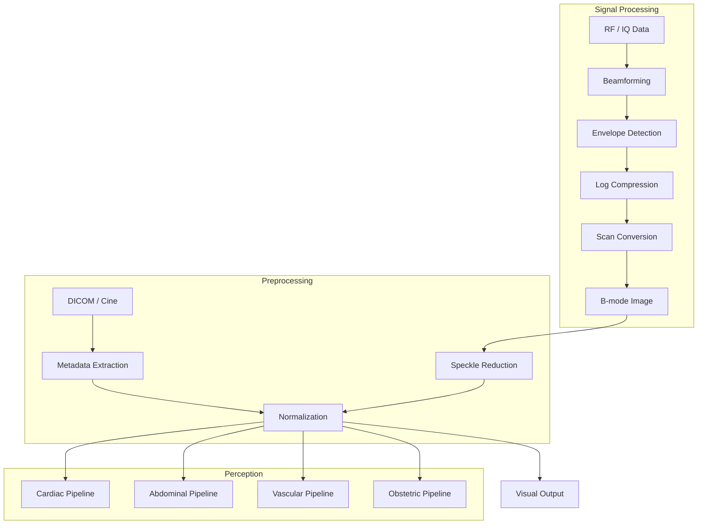

# Ultrasound Modality Architecture

**Last Updated: December 2025**

---

## Overview

This document describes the Rhenium OS Ultrasound subsystem, covering B-mode, Doppler, and Elastography processing, as well as organ-specific perception pipelines.

---

## Supported Ultrasound Modes

| Mode | Description | Clinical Use |
|------|-------------|--------------|
| B-mode | 2D Grayscale | Anatomy, structure, masses |
| M-mode | Motion vs Time | Cardiac valves, fetal heart rate |
| Color Doppler | Velocity overlay | Blood flow direction/presence |
| Spectral Doppler | Velocity waveform | Peak velocities, stenosis |
| Elastography | Stiffness map | Liver fibrosis, tumor characterization |
| CEUS | Contrast Enhanced | Lesion vascularity (Microbubbles) |

---

## Ultrasound Data Pipeline

---

## Organ-Specific Pipelines

### Cardiac Echo
- **Input**: Apical 4-chamber (A4C), A2C, PLAX views.
- **Tasks**:
    - LV/RV Segmentation (U-Net)
    - Ejection Fraction (Simpson's method)
    - GLS (Global Longitudinal Strain)
    - Diastolic function evaluation

### Vascular Ultrasound
- **Input**: Carotid, Femoral/Popliteal views.
- **Tasks**:
    - CIMT measurement (Edge detection)
    - Plaque segmentation
    - DVT compressibility check

### Obstetric Ultrasound
- **Input**: Fetal head, abdomen, femur views.
- **Tasks**:
    - Biometry: BPD, HC, AC, FL
    - Estimated Fetal Weight (EFW) calculation
    - Standard plane verification

---

## Beamforming Architecture

Rhenium OS supports software-defined ultrasound beamforming interfaces:

1. **Delay-and-Sum (DAS)**: Standard synthetic aperture or dynamic receive focusing.
2. **Apodization**: Hamming/Hanning windowing to reduce sidelobes.
3. **Scan Conversion**: Mapping polar/sector coordinates to Cartesian grid.

---

## Module Reference

| Module | Path | Description |
|--------|------|-------------|
| Data Layer | `rhenium/data/modality_ultrasound.py` | DICOM, probes, preprocessing |
| Beamforming | `rhenium/reconstruction/ultrasound/beamforming.py` | RF processing |
| Enhancement | `rhenium/reconstruction/ultrasound/enhancement.py` | Speckle reduction |
| Cardiac Echo | `rhenium/perception/organ/cardiac/echo_models.py` | EF, chambers |
| Vascular | `rhenium/perception/organ/vascular/models.py` | CIMT, DVT |
| Obstetrics | `rhenium/perception/organ/obstetric/models.py` | Fetal biometry |
| Small Parts | `rhenium/perception/organ/thyroid/models.py` | Thyroid, Breast, MSK |

---

**Copyright (c) 2025 Skolyn LLC. All rights reserved.**
