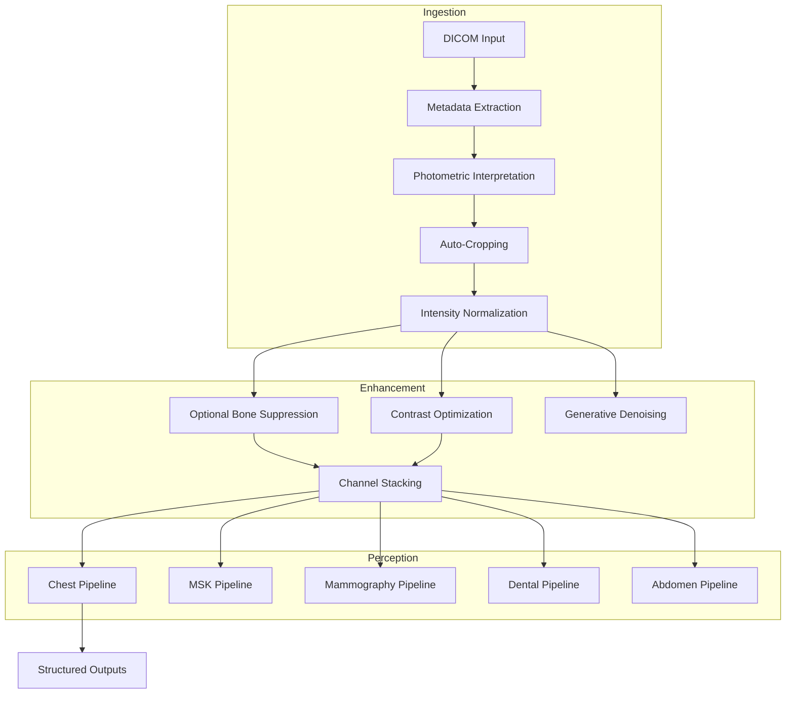

# X-ray Modality Architecture

**Last Updated: December 2025**

---

## Overview

This document describes the Rhenium OS X-ray subsystem, covering general radiography, mammography, and dental imaging. It details the pipeline from DICOM ingestion, through enhancement and preprocessing, to organ-specific perception models.

---

## Supported X-ray Modalities

| Modality | DICOM | Clinical Use |
|----------|-------|--------------|
| General Radiography | DX / CR | Chest (CXR), MSK, Abdomen |
| Mammography | MG | Breast Cancer Screening (FFDM, DBT) |
| Dental | IO / PX | Caries, Periapical pathology, Ortho |
| Fluoroscopy | RF / XA | Snapshots, Interventional key frames |

---

## X-ray Data Pipeline

---

## Preprocessing & Enhancement

Rhenium OS standardizes X-ray pixel data:
1. **Inversion**: Ensures MONOCHROME2 appearence (Bones white, Air black).
2. **Normalization**: Min-max or Z-score scaling.
3. **Bone Suppression**: Optional DL-based suppression of ribs/clavicles for CXR lung nodule detection.
4. **Contrast**: Adaptive histogram equalization (CLAHE) for feature enhancement.

---

## Organ-Specific Pipelines

### Chest X-ray (CXR)
- **Tasks**:
    - Triage (Normal vs Abnormal)
    - Pathology Detection (Pneumonia, Effusion, Nodule, Pneumothorax)
    - Segmentation (Lung fields, Heart score)

### Musculoskeletal (MSK)
- **Tasks**:
    - Fracture Detection (Bounding boxes)
    - Knee OA Grading (Kellgren-Lawrence)
    - Bone Age (Pediatric Hand/Wrist)

### Mammography
- **Tasks**:
    - Lesion Detection (Mass, Calcification)
    - Density Classification (BI-RADS A-D)
    - Multi-view aggregation (CC + MLO)

### Dental
- **Tasks**:
    - Tooth Numbering
    - Caries Detection
    - Bone Loss Evaluation

---

## Module Reference

| Module | Path | Description |
|--------|------|-------------|
| Data Layer | `rhenium/data/modality_xray.py` | DICOM, Metadata, Ingestion |
| Preprocessing | `rhenium/enhancement/xray/preprocessing.py` | Normalization, Cropping |
| Bone Supp. | `rhenium/enhancement/xray/bone_suppression.py` | Soft tissue image generation |
| Chest Models | `rhenium/perception/organ/chest_xray/models.py` | Triage, Pathology |
| MSK Models | `rhenium/perception/organ/msk_xray/models.py` | Fracture, Bone Age |
| Mammo Models | `rhenium/perception/organ/mammography/models.py` | Lesion detection |

---

**Copyright (c) 2025 Skolyn LLC. All rights reserved.**
