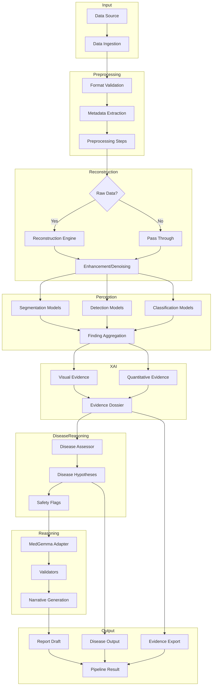
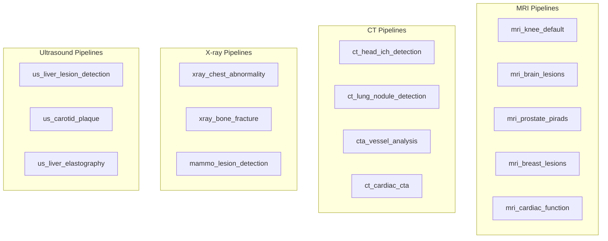
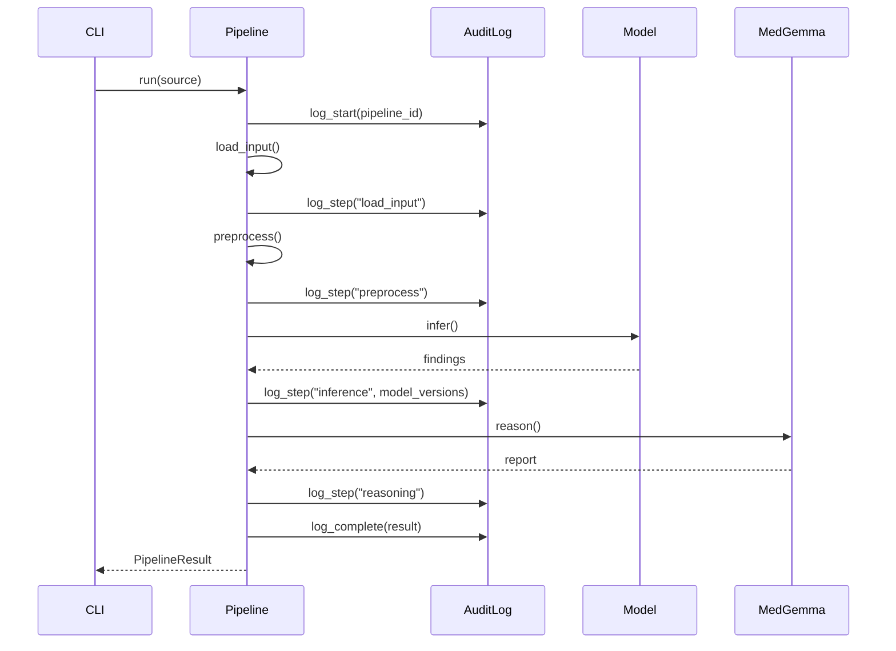
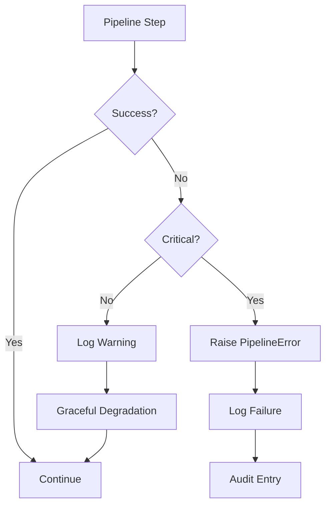

# Pipeline Architecture

---

## Overview

This document describes the pipeline architecture in Rhenium OS, including composition patterns, execution flow, and configuration.

---

## Pipeline Execution Flow



---

## Pipeline Configuration

### YAML Structure

```yaml
# Example: mri_knee_meniscus.yaml

name: mri_knee_meniscus
version: "1.0.0"
description: "Knee MRI meniscus analysis pipeline"
pipeline_type: mri_knee

input:
  modality: MR
  body_part: KNEE
  required_sequences:
    - PD_FS
    - T2_SAGITTAL

preprocessing:
  steps:
    - type: intensity_normalization
      params:
        method: percentile
        lower: 1
        upper: 99
    - type: bias_field_correction
      params:
        n4itk: true
    - type: registration
      params:
        reference: PD_FS

reconstruction:
  enabled: false

perception:
  models:
    - name: meniscus_segmentation_v2
      type: segmentation
      targets: [medial_meniscus, lateral_meniscus]
    - name: meniscus_tear_detection_v1
      type: detection
      threshold: 0.5

xai:
  visual:
    enabled: true
    types: [segmentation_overlay, saliency_map]
  quantitative:
    enabled: true
    measurements: [tear_length, meniscus_volume]

medgemma:
  enabled: true
  template: mri_knee_meniscus
  generate_report: true
  validators: [consistency, laterality, high_risk]

output:
  format: json
  include_dossiers: true
```

---

## Pipeline Types

### By Modality



### By Task Type

| Task Type | Pipeline Examples |
|-----------|-------------------|
| Segmentation | knee_meniscus, brain_lesions, prostate_zones |
| Detection | lung_nodule, ich_detection, lesion_detection |
| Classification | pirads_scoring, birads_classification |
| Quantification | atrophy_volume, fibrosis_staging |

---

## Abstract Pipeline Interface

```python
class BasePipeline(ABC):
    """Abstract base class for all Rhenium OS pipelines."""
    
    name: str
    version: str
    modality: Modality
    
    @abstractmethod
    def load_input(self, source: str | Path) -> Any:
        """Load and validate input data."""
        pass
    
    @abstractmethod
    def preprocess(self, data: Any) -> Any:
        """Apply preprocessing steps."""
        pass
    
    @abstractmethod
    def reconstruct(self, data: Any) -> ImageVolume:
        """Reconstruct from raw data if applicable."""
        pass
    
    @abstractmethod
    def infer(self, volume: ImageVolume) -> list[Finding]:
        """Run perception models."""
        pass
    
    @abstractmethod
    def generate_evidence(
        self, 
        volume: ImageVolume, 
        findings: list[Finding]
    ) -> list[EvidenceDossier]:
        """Generate XAI evidence dossiers."""
        pass
    
    @abstractmethod
    def reason(
        self, 
        findings: list[Finding], 
        dossiers: list[EvidenceDossier]
    ) -> ReportDraft:
        """Generate MedGemma narrative."""
        pass
    
    def run(self, source: str | Path) -> PipelineResult:
        """Execute full pipeline."""
        data = self.load_input(source)
        data = self.preprocess(data)
        volume = self.reconstruct(data)
        findings = self.infer(volume)
        dossiers = self.generate_evidence(volume, findings)
        report = self.reason(findings, dossiers)
        
        return PipelineResult(
            findings=findings,
            dossiers=dossiers,
            report=report,
            metadata=self._build_metadata(),
        )
```

---

## Step Logging and Audit



---

## Error Handling



---

## Performance Modes

| Mode | Description | Use Case |
|------|-------------|----------|
| Standard | Full pipeline with all XAI | Production reporting |
| Fast | Skip optional XAI, reduced resolution | Triage, screening |
| Detailed | Maximum XAI, highest resolution | Second reads, complex cases |
| Debug | Full logging, intermediate outputs | Development, troubleshooting |

---

**Copyright (c) 2025 Skolyn LLC. All rights reserved.**

