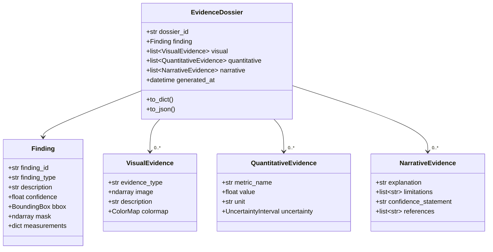
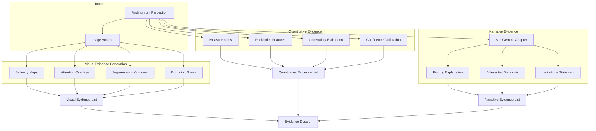
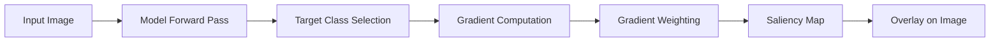
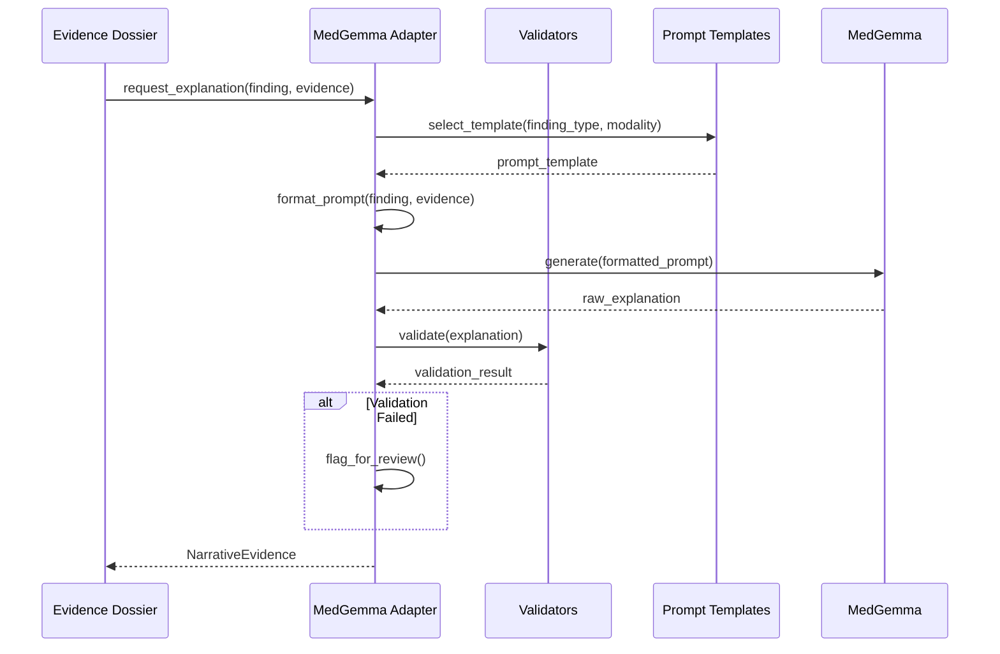
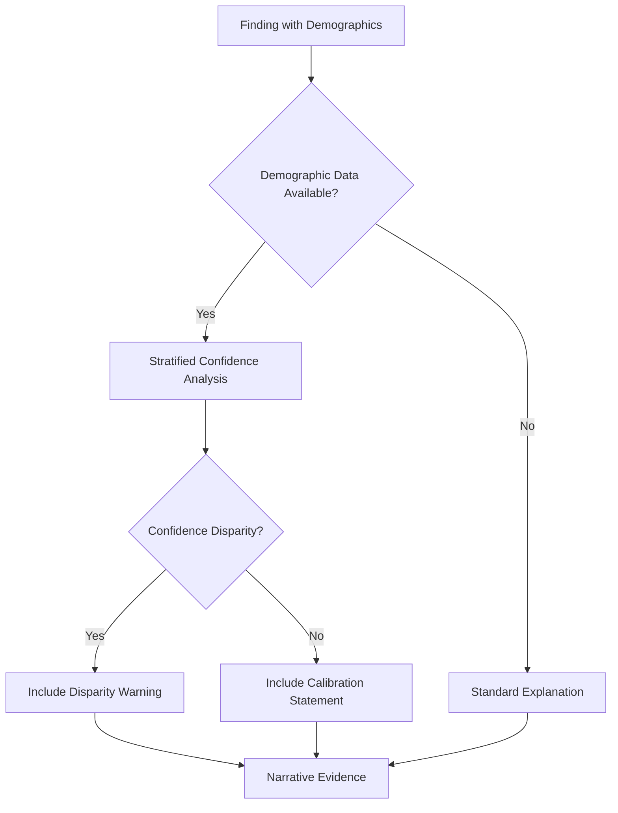

# XAI Architecture

**
---

## Overview

This document describes the explainability (XAI) architecture in Rhenium OS, including evidence dossier structure, generation flow, and integration with MedGemma.

---

## Evidence Dossier Structure



---

## XAI Generation Flow



---

## Visual Evidence Types

| Type | Description | Generation Method |
|------|-------------|-------------------|
| Saliency Map | Pixel-level importance | Grad-CAM, Integrated Gradients |
| Attention Overlay | Model attention regions | Transformer attention weights |
| Segmentation Contour | Predicted structure boundary | Thresholded probability map |
| Bounding Box | Localized detection region | Detection model output |
| Difference Map | Comparison to reference | Subtraction, reconstruction error |

### Saliency Generation



---

## Quantitative Evidence

### Measurements

| Measurement | Applicable Findings | Unit |
|-------------|---------------------|------|
| Maximum diameter | Lesions, tumors | mm |
| Volume | Segmented structures | mm³, mL |
| Mean intensity | ROI analysis | HU, signal intensity |
| Texture features | Radiomics | Various |
| ADC value | DWI lesions | × 10⁻³ mm²/s |

### Uncertainty Quantification

$$\text{Uncertainty} = \sqrt{\text{Var}(\hat{y})}$$

Methods:
- Monte Carlo Dropout
- Deep Ensembles
- Bayesian Neural Networks

### Calibration

$$P(\hat{y} = y | \text{conf}(\hat{y}) = p) = p$$

Measured via Expected Calibration Error (ECE).

---

## MedGemma Integration for XAI



---

## Narrative Templates

### Structure

```yaml
template:
  name: mri_brain_lesion_explanation
  modality: MRI
  finding_type: brain_lesion
  
  system_prompt: |
    You are a neuroradiology assistant explaining findings...
    
  user_prompt: |
    FINDING: {finding_description}
    LOCATION: {anatomical_location}
    SIZE: {measurements}
    SIGNAL CHARACTERISTICS: {signal_info}
    CONFIDENCE: {confidence}
    
    Provide a clinical explanation including:
    1. Description of the finding
    2. Differential diagnosis
    3. Recommended follow-up
    4. Limitations of AI assessment
    
  required_sections:
    - description
    - differential
    - recommendation
    - limitations
```

---

## Fairness-Aware XAI



### Disparity Disclosure

When performance disparities exist across subgroups, narrative evidence includes:

> "Note: Model confidence for this demographic subgroup may differ from overall calibration. Clinical correlation is especially important."

---

## Evidence Export Formats

| Format | Use Case | Contents |
|--------|----------|----------|
| JSON | API integration | Full structured data |
| HTML | Human review | Rendered visuals + text |
| DICOM-SR | PACS integration | Structured report |
| PDF | Clinical documentation | Formatted report |

---

**Copyright (c) 2025 Skolyn LLC. All rights reserved.**

****
