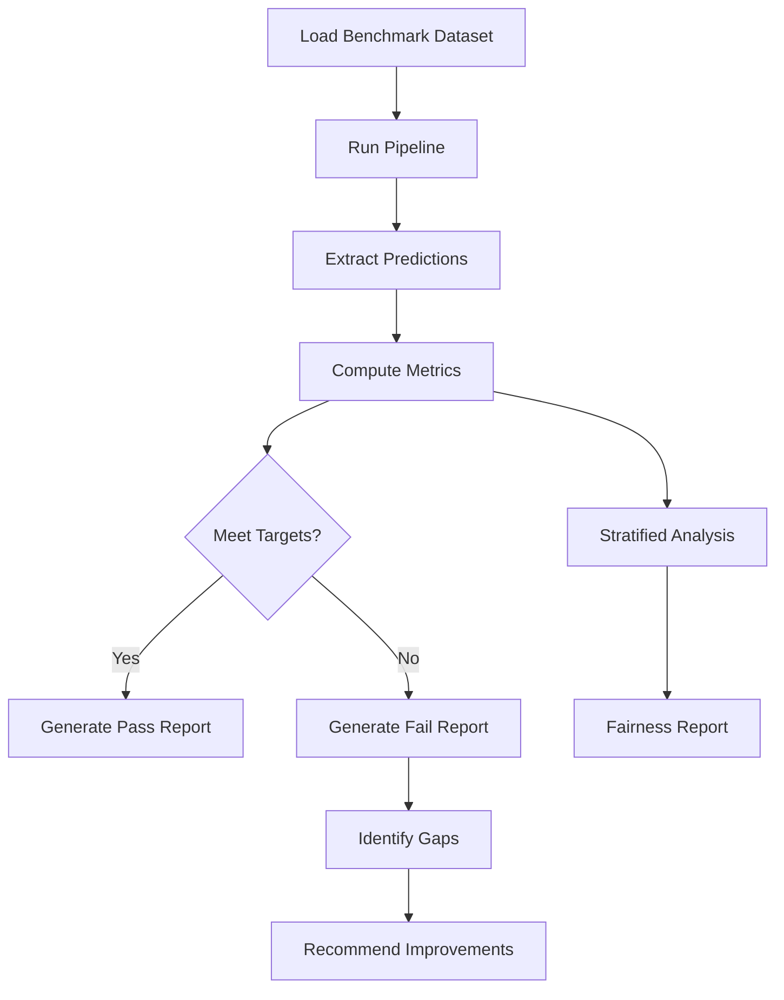

# Modality-Specific Benchmarks

**
---

## Overview

This document defines benchmark suites and quality metrics for each imaging modality supported by Rhenium OS.

---

## MRI Benchmarks

### Reconstruction Quality

| Acceleration | Method | PSNR Target | SSIM Target | Dataset |
|--------------|--------|-------------|-------------|---------|
| 4x | IFFT baseline | 28 dB | 0.85 | Knee MRI |
| 4x | DL (U-Net) | 34 dB | 0.92 | Knee MRI |
| 4x | PINN-enhanced | 35 dB | 0.93 | Knee MRI |
| 4x | Rhenium OS | > 36 dB | > 0.94 | Knee MRI |
| 8x | IFFT baseline | 24 dB | 0.78 | Brain MRI |
| 8x | DL (VarNet-style) | 31 dB | 0.88 | Brain MRI |
| 8x | Rhenium OS | > 32 dB | > 0.90 | Brain MRI |

### Sequence-Specific Processing

| Sequence | Task | Metric | Target |
|----------|------|--------|--------|
| T1/T2 Mapping | Relaxometry accuracy | MAE | < 5% of ground truth |
| DWI | ADC map quality | Correlation | > 0.98 |
| DCE | Pharmacokinetic fitting | Ktrans error | < 10% |
| fMRI | Motion correction | DVARS reduction | > 50% |

---

## CT Benchmarks

### Low-Dose Denoising

| Dose Level | Method | PSNR Target | SSIM Target | HU MAE |
|------------|--------|-------------|-------------|--------|
| 25% dose | No processing | 28 dB | 0.82 | 25 HU |
| 25% dose | BM3D | 32 dB | 0.88 | 15 HU |
| 25% dose | DL denoising | 35 dB | 0.92 | 8 HU |
| 25% dose | Rhenium OS | > 36 dB | > 0.93 | < 6 HU |

### Protocol-Specific Tasks

| Protocol | Task | Metric | Target |
|----------|------|--------|--------|
| Non-contrast head | ICH detection | AUC | > 0.95 |
| CTA pulmonary | PE detection | Sensitivity at 95% spec | > 0.90 |
| CTA coronary | Stenosis grading | Weighted kappa | > 0.80 |
| Low-dose chest | Nodule detection | FROC at 1 FP/scan | > 0.90 |
| Dual-energy | Material decomposition | MAE | < 5 HU |

### Hounsfield Unit Consistency

$$\text{HU MAE} = \frac{1}{N} \sum_{i=1}^{N} |\text{HU}_{\text{pred},i} - \text{HU}_{\text{ref},i}|$$

Target: HU MAE < 5 for soft tissue, < 10 for bone.

---

## X-ray Benchmarks

### Image Quality Enhancement

| Task | Metric | Baseline | Target |
|------|--------|----------|--------|
| Noise reduction | PSNR | 30 dB | > 35 dB |
| Contrast enhancement | CNR improvement | 1.0x | > 1.5x |
| Scatter correction | Scatter ratio | 0.4 | < 0.1 |

### Detection Performance

| View | Task | Metric | Target |
|------|------|--------|--------|
| Chest PA | Multi-label classification | Mean AUC | > 0.80 |
| Chest PA | Cardiomegaly | AUC | > 0.90 |
| Lateral | Pneumothorax | Sensitivity | > 0.95 |
| Skeletal | Fracture detection | AUC | > 0.90 |

### Mammography

| Task | Metric | Target |
|------|--------|--------|
| Mass detection | FROC at 0.3 FP/image | > 0.85 |
| Microcalcification detection | Sensitivity at 90% spec | > 0.90 |
| Density classification | 4-class accuracy | > 0.80 |
| Abnormality detection | AUC | > 0.85 |

---

## Ultrasound Benchmarks

### Image Quality

| Mode | Task | Metric | Target |
|------|------|--------|--------|
| B-mode | Speckle reduction CNR | Improvement | > 1.5x |
| B-mode | Resolution | -6dB lateral | < 2 wavelengths |
| Doppler | Velocity accuracy | MAE vs. reference | < 5% |
| Elastography | Stiffness accuracy | Correlation | > 0.95 |

### Clinical Tasks

| Application | Task | Metric | Target |
|-------------|------|--------|--------|
| Liver | Focal lesion detection | AUC | > 0.80 |
| Liver | Fibrosis staging (elastography) | Ordinal AUC | > 0.85 |
| Carotid | Stenosis estimation | Correlation | > 0.90 |
| Thyroid | Nodule TI-RADS classification | AUC | > 0.80 |
| Obstetric | Biometry accuracy | MAE | < 2 mm |

---

## Cross-Modality Comparison

| Metric | MRI | CT | X-ray | US |
|--------|-----|----|----|-----|
| Reconstruction PSNR | > 35 dB | > 36 dB | N/A | N/A |
| Reconstruction SSIM | > 0.93 | > 0.93 | N/A | N/A |
| Segmentation Dice | > 0.85 | > 0.90 | N/A | > 0.80 |
| Detection AUC | > 0.90 | > 0.92 | > 0.85 | > 0.80 |
| Classification AUC | > 0.88 | > 0.90 | > 0.85 | > 0.80 |

---

## Benchmark Dataset Requirements

### Minimum Dataset Sizes

| Modality | Training | Validation | Test | External Test |
|----------|----------|------------|------|---------------|
| MRI | 1000 | 200 | 200 | 100 |
| CT | 500 | 100 | 100 | 50 |
| X-ray | 10000 | 2000 | 2000 | 1000 |
| US | 500 | 100 | 100 | 50 |

### Annotation Requirements

- **Segmentation**: Pixel-level ground truth by 2+ experts, adjudicated
- **Detection**: Bounding boxes with confirmed pathology
- **Classification**: Label by clinical report or pathology
- **Inter-reader agreement**: ICC > 0.80 required

---

## Evaluation Protocol

---

**Copyright (c) 2025 Skolyn LLC. All rights reserved.**

**SPDX-License-Identifier: EUPL-1.1**
