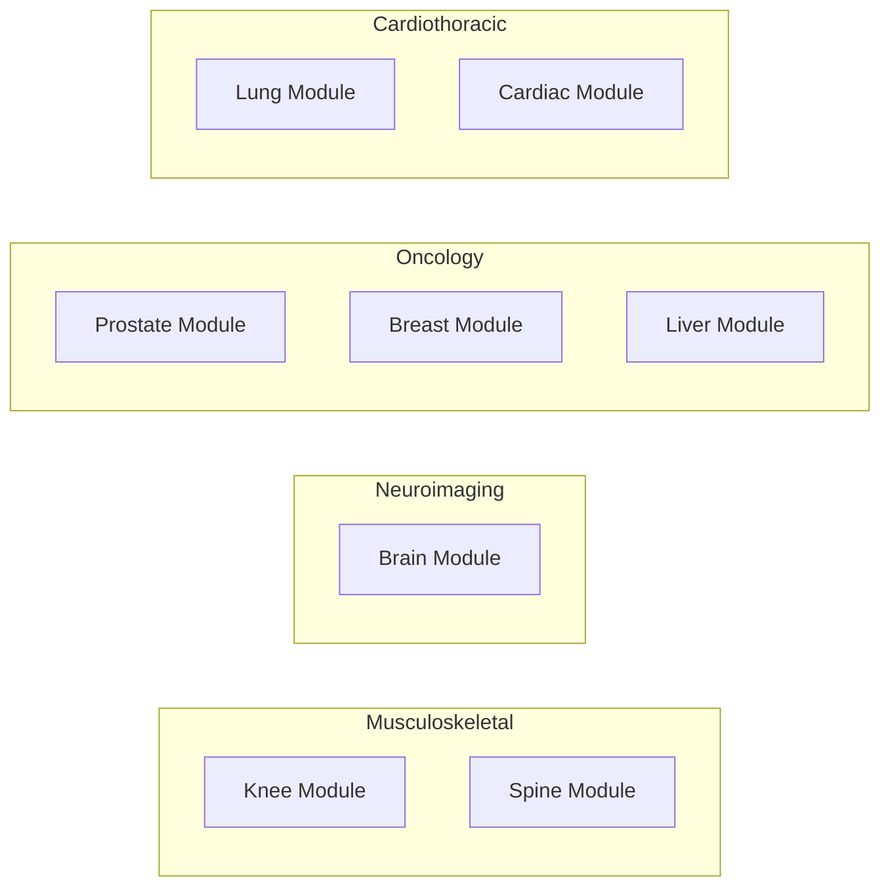

# Organ-Specific Benchmarks

**Last Updated: December 2025**

---

## Overview

This document defines benchmark suites and performance targets for organ-specific analysis modules in Rhenium OS.

---

## Knee Module Benchmarks

### Tasks and Metrics

| Task | Primary Metric | Target | Dataset Type |
|------|----------------|--------|--------------|
| Meniscus segmentation | Dice | > 0.85 | Multi-site knee MRI |
| Meniscus tear detection | AUC | > 0.95 | Labeled tear dataset |
| Cartilage segmentation | Dice | > 0.88 | Annotated cartilage |
| Cartilage grading (Outerbridge) | Cohen's kappa | > 0.75 | Graded dataset |
| ACL tear detection | Sensitivity | > 0.90 | Ligament injury set |
| Bone marrow lesion detection | AUC | > 0.85 | BML annotated set |

### MRI Sequences Required

- PD-FS (sagittal, coronal)
- T2-weighted
- T1-weighted (optional)

### Baseline Comparisons

| Method | Meniscus Dice | Tear AUC | Cartilage Dice |
|--------|---------------|----------|----------------|
| Classical atlas-based | 0.72 | 0.78 | 0.75 |
| U-Net (2D) | 0.81 | 0.91 | 0.83 |
| 3D U-Net | 0.84 | 0.93 | 0.86 |
| Rhenium OS (Target) | > 0.85 | > 0.95 | > 0.88 |

---

## Brain Module Benchmarks

### Tasks and Metrics

| Task | Primary Metric | Target | Dataset Type |
|------|----------------|--------|--------------|
| White matter lesion segmentation | Dice | > 0.80 | Multi-site FLAIR |
| Lesion count accuracy | MAE | < 2 lesions | Counted lesion set |
| Brain tumor segmentation | Dice (whole tumor) | > 0.85 | Glioma dataset |
| Enhancing tumor segmentation | Dice (enhancing) | > 0.75 | Contrast dataset |
| Hemorrhage detection | AUC | > 0.95 | Emergency brain CT/MRI |
| Atrophy quantification | Volume correlation | > 0.95 | Longitudinal set |

### MRI Sequences Required

- T1-weighted (pre and post contrast)
- T2-weighted
- FLAIR
- DWI/ADC (for acute pathology)

### Baseline Comparisons

| Method | WM Lesion Dice | Tumor Dice | Hemorrhage AUC |
|--------|----------------|------------|----------------|
| Threshold-based | 0.55 | N/A | 0.75 |
| Random Forest | 0.68 | 0.70 | 0.85 |
| 3D U-Net | 0.77 | 0.82 | 0.92 |
| nnU-Net | 0.79 | 0.84 | 0.94 |
| Rhenium OS (Target) | > 0.80 | > 0.85 | > 0.95 |

---

## Prostate Module Benchmarks

### Tasks and Metrics

| Task | Primary Metric | Target | Dataset Type |
|------|----------------|--------|--------------|
| Prostate segmentation | Dice | > 0.90 | Multi-parametric MRI |
| Zone segmentation (PZ/TZ) | Dice | > 0.85 | Zone-annotated set |
| Lesion detection | Sensitivity at 1 FP | > 0.85 | PI-RADS annotated |
| PI-RADS classification | Weighted kappa | > 0.70 | Expert-scored dataset |
| Lesion segmentation | Dice | > 0.60 | Lesion-delineated set |

### MRI Sequences Required

- T2-weighted (axial, sagittal, coronal)
- DWI/ADC (multiple b-values)
- DCE (optional but recommended)

### Baseline Comparisons

| Method | Prostate Dice | Detection Sens | PI-RADS kappa |
|--------|---------------|----------------|---------------|
| Atlas-based | 0.82 | N/A | N/A |
| U-Net (2D) | 0.87 | 0.75 | 0.55 |
| nnU-Net | 0.89 | 0.82 | 0.65 |
| Rhenium OS (Target) | > 0.90 | > 0.85 | > 0.70 |

---

## Breast Module Benchmarks

### Tasks and Metrics (MRI)

| Task | Primary Metric | Target | Dataset Type |
|------|----------------|--------|--------------|
| Breast segmentation | Dice | > 0.92 | Breast MRI dataset |
| Lesion detection | Sensitivity at 90% spec | > 0.85 | Lesion-annotated |
| Lesion segmentation | Dice | > 0.75 | Delineated lesions |
| BI-RADS classification | AUC | > 0.85 | BI-RADS scored set |

### Tasks and Metrics (Mammography)

| Task | Primary Metric | Target | Dataset Type |
|------|----------------|--------|--------------|
| Mass detection | FROC at 0.3 FP/image | > 0.85 | Screening mammography |
| Calcification detection | Sensitivity | > 0.90 | Calcification dataset |
| Density classification | Multi-class AUC | > 0.90 | Density-labeled set |

---

## Chest Module Benchmarks

### CT Tasks

| Task | Primary Metric | Target | Dataset Type |
|------|----------------|--------|--------------|
| Lung nodule detection | FROC at 1 FP/scan | > 0.90 | Thoracic CT |
| Nodule segmentation | Dice | > 0.80 | Nodule-delineated |
| Malignancy prediction | AUC | > 0.85 | Follow-up confirmed |
| Emphysema quantification | Correlation | > 0.95 | Densitometry ground truth |

### X-ray Tasks

| Task | Primary Metric | Target | Dataset Type |
|------|----------------|--------|--------------|
| Multi-label classification | Mean AUC | > 0.80 | Chest X-ray dataset |
| Cardiomegaly detection | AUC | > 0.90 | CTR-labeled set |
| Pneumothorax detection | Sensitivity | > 0.95 | Emergency dataset |
| Pleural effusion detection | AUC | > 0.90 | Effusion-labeled |

---

## Liver Module Benchmarks

### CT Tasks

| Task | Primary Metric | Target | Dataset Type |
|------|----------------|--------|--------------|
| Liver segmentation | Dice | > 0.95 | Multi-phase CT |
| Lesion detection | Sensitivity at 3 FP/case | > 0.85 | Lesion-annotated |
| Lesion characterization | Multi-class AUC | > 0.80 | Pathology-confirmed |
| Cirrhosis staging | Ordinal AUC | > 0.80 | Staged dataset |

### Ultrasound Tasks

| Task | Primary Metric | Target | Dataset Type |
|------|----------------|--------|--------------|
| Focal lesion detection | AUC | > 0.80 | Liver US dataset |
| Steatosis grading | Correlation | > 0.85 | MRI-PDFF ground truth |
| Elastography staging | Ordinal kappa | > 0.75 | Biopsy-confirmed |

---

## Cross-Organ Summary

---

## Fairness Requirements

All organ benchmarks must include:

1. **Demographic stratification** (age, sex where available)
2. **Scanner/site stratification** (multi-vendor, multi-site)
3. **Disparity analysis** with maximum acceptable gap: 0.10 absolute metric difference
4. **Calibration analysis** per subgroup

---

**Copyright (c) 2025 Skolyn LLC. All rights reserved.**

**SPDX-License-Identifier: EUPL-1.1**
