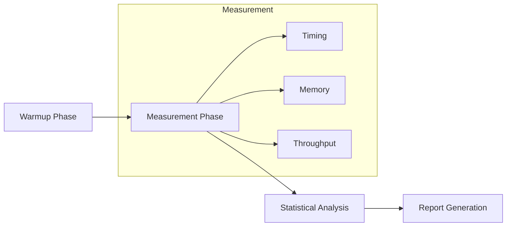
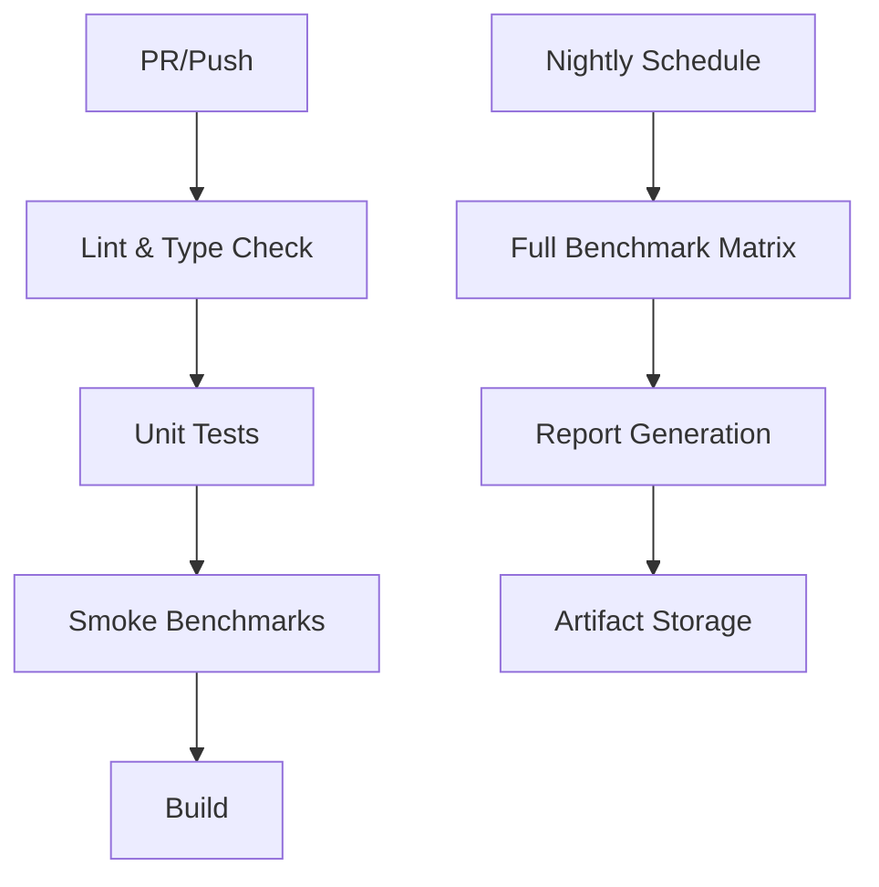

# Performance Measurement Methodology

This document describes the methodology used for performance benchmarks in Rhenium OS.

## Overview



## Timing Methodology

### Measurement Approach

1. **Wall-clock time**: Primary metric using `time.time()` or `time.perf_counter()`
2. **Python-level timing**: Measures end-to-end including Python overhead
3. **No warmup exclusion**: First run included (realistic for single-study processing)

### Warmup Considerations

For GPU benchmarks:
- First inference triggers CUDA kernel compilation
- JIT compilation overhead included in first measurement
- Recommendation: Report both first-run and steady-state times

### Code Example

```python
import time

start = time.time()
result = model.run(volume, task=TaskType.SEGMENTATION)
elapsed = time.time() - start
```

## Memory Measurement

### CPU Memory

- Peak RSS (Resident Set Size) via `resource.getrusage()`
- Python object overhead included

### GPU Memory

```python
import torch

torch.cuda.reset_peak_memory_stats()
result = model.run(volume, task=TaskType.SEGMENTATION)
peak_memory_mb = torch.cuda.max_memory_allocated() / (1024 * 1024)
```

## Statistical Reporting

### Metrics Collected

| Metric | Description |
|--------|-------------|
| p50 | Median latency |
| p95 | 95th percentile latency |
| mean | Average latency |
| std | Standard deviation |
| min/max | Range bounds |

### Variance Sources

1. **System noise**: Other processes, OS scheduling
2. **Python GC**: Garbage collection pauses
3. **CUDA async**: GPU operation scheduling
4. **Thermal throttling**: CPU/GPU frequency changes

### Mitigation

- Multiple runs per configuration
- Percentile reporting (p50/p95) over mean
- Isolated test environment when possible

## Device-Specific Notes

### CPU

- Single-threaded by default
- PyTorch may use multiple threads for certain ops
- Set `torch.set_num_threads(1)` for reproducible timing

### GPU (CUDA)

- Ensure `torch.cuda.synchronize()` before timing for accurate GPU measurement
- Memory reported is VRAM, not system RAM
- PCIe transfer time included in measurements

## Benchmark Environment

### Recommended Setup

```bash
# Dedicated testing
export OMP_NUM_THREADS=1
export MKL_NUM_THREADS=1

# GPU: Exclusive mode
nvidia-smi -c EXCLUSIVE_PROCESS

# Run benchmarks
python scripts/run_benchmarks.py --full --json
```

### Environment Recording

Each report includes:
- Python version
- Rhenium version
- Device information
- Timestamp

## Thresholds and Targets

| Test Category | CPU Target | GPU Target |
|---------------|------------|------------|
| Smoke test (tiny vol) | < 1.0s | < 0.5s |
| Standard volume (64³) | < 5.0s | < 1.0s |
| Large volume (128³) | < 30s | < 5.0s |
| Startup time | < 10s | < 15s |
| Peak memory | < 4GB | < 8GB |

## Interpreting Results

### Pass Criteria

- All tests complete without crash
- No NaN/Inf in outputs
- Latency within thresholds
- Memory within bounds

### Failure Investigation

1. Check for OOM (Out of Memory)
2. Verify input data validity
3. Check device availability
4. Review error logs

## Continuous Integration



### CI Smoke Tests

- Run on every PR/push
- ~50 tests, < 2 minutes
- CPU only
- Fail-fast on critical issues

### Nightly Full Suite

- 576+ test cases
- GPU tests if available
- Full report generation
- Performance trend tracking
