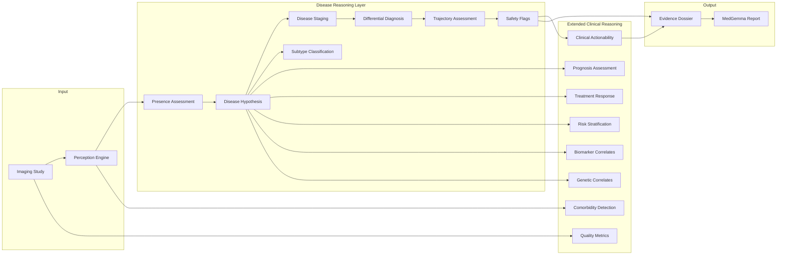

# Clinical Procedures Reference

This document provides a comprehensive reference for all clinical reasoning procedures implemented in Rhenium OS.

---

## Overview

Rhenium OS implements structured clinical reasoning through a series of assessment procedures. Each procedure addresses a specific clinical question and produces standardized outputs that integrate with the Evidence Dossier and MedGemma reporting systems.



---

## Core Clinical Procedures

### 1. Disease Presence Assessment

**Clinical Question:** Is there evidence of disease in this study?

**Output Model:** `DiseasePresenceAssessment`

| Field | Type | Description |
|-------|------|-------------|
| `disease_present` | Enum | PRESENT, ABSENT, UNCERTAIN, NOT_EVALUATED |
| `overall_abnormality_score` | Float | Aggregate abnormality score (0.0-1.0) |
| `uncertainty_score` | Float | Assessment uncertainty (0.0-1.0) |
| `rationale` | String | Brief explanation |
| `limitations` | List[String] | Assessment limitations |

**Formula:**

$$
\text{Abnormality Score} = \frac{\sum_{i=1}^{n} w_i \cdot f_i}{\sum_{i=1}^{n} w_i}
$$

Where:
- $w_i$ = weight for feature $i$
- $f_i$ = normalized feature value

---

### 2. Disease Hypothesis

**Clinical Question:** What disease is most likely present?

**Output Model:** `DiseaseHypothesis`

| Field | Type | Description |
|-------|------|-------------|
| `disease_code` | String | Standardized disease code |
| `disease_name` | String | Human-readable name |
| `probability` | Float | Probability (0.0-1.0) |
| `rank` | Integer | Rank among hypotheses |
| `supporting_features` | List[String] | Features supporting diagnosis |
| `contradicting_features` | List[String] | Features against diagnosis |

**Bayesian Inference:**

$$
P(D|F) = \frac{P(F|D) \cdot P(D)}{P(F)}
$$

Where:
- $P(D|F)$ = Posterior probability of disease given features
- $P(F|D)$ = Likelihood of features given disease
- $P(D)$ = Prior probability of disease
- $P(F)$ = Evidence

---

### 3. Disease Subtype Classification

**Clinical Question:** Which subtype or variant is present?

**Output Model:** `DiseaseSubtypeHypothesis`

| Field | Type | Description |
|-------|------|-------------|
| `disease_code` | String | Parent disease |
| `subtype_code` | String | Subtype identifier |
| `subtype_name` | String | Human-readable subtype |
| `probability` | Float | Probability (0.0-1.0) |
| `imaging_features` | List[String] | Key imaging features |

---

### 4. Disease Stage Assessment

**Clinical Question:** What is the disease stage/severity?

**Output Model:** `DiseaseStageAssessment`

| Field | Type | Description |
|-------|------|-------------|
| `staging_system` | String | e.g., "TNM-like surrogate" |
| `stage_label` | String | e.g., "Stage II", "Moderate" |
| `t_component` | String | Tumor component |
| `n_component` | String | Node component |
| `m_component` | String | Metastasis component |
| `severity_score` | Float | Continuous severity (0.0-1.0) |

**TNM-like Staging Formula:**

$$
\text{Size Score} = \min\left(\frac{d_{\max}}{T_{\text{threshold}}}, 1.0\right)
$$

---

### 5. Differential Diagnosis

**Clinical Question:** What are the alternative diagnoses?

**Output Model:** `DifferentialDiagnosisEntry`

| Field | Type | Description |
|-------|------|-------------|
| `rank` | Integer | Position in differential |
| `disease_code` | String | Disease code |
| `estimated_probability` | Float | Probability (0.0-1.0) |
| `cannot_exclude_flag` | Boolean | If "cannot exclude" applies |
| `suggested_additional_tests` | List[String] | Recommended tests |

---

### 6. Disease Trajectory Assessment

**Clinical Question:** How has the disease changed over time?

**Output Model:** `DiseaseTrajectoryAssessment`

| Field | Type | Description |
|-------|------|-------------|
| `trajectory_label` | Enum | IMPROVED, STABLE, WORSENED, NEW_FINDINGS |
| `quantitative_deltas` | Dict | Numeric changes |
| `new_lesion_count` | Integer | New lesions detected |
| `resolved_lesion_count` | Integer | Resolved lesions |
| `response_category` | String | Treatment response if applicable |

**Volume Change Formula:**

$$
\Delta V = \frac{V_{\text{current}} - V_{\text{prior}}}{V_{\text{prior}}} \times 100\%
$$

---

### 7. Clinical Safety Flags

**Clinical Question:** Are there urgent findings requiring escalation?

**Output Model:** `ClinicalSafetyFlag`

| Field | Type | Description |
|-------|------|-------------|
| `flag_type` | Enum | URGENT_FINDING, REQUIRES_ESCALATION, etc. |
| `severity` | Enum | LOW, MODERATE, HIGH, CRITICAL |
| `escalation_required` | Boolean | Whether to escalate |
| `time_sensitivity` | String | e.g., "immediate", "24h" |
| `recommended_action` | String | Suggested action |

---

## Extended Clinical Procedures

### 8. Prognosis Assessment

**Clinical Question:** What is the predicted outcome based on imaging?

**Output Model:** `PrognosisAssessment`

| Field | Type | Description |
|-------|------|-------------|
| `prognosis_category` | Enum | EXCELLENT to VERY_POOR |
| `prognosis_score` | Float | Score (0.0-1.0, higher = worse) |
| `survival_estimate_months` | Float | Estimated survival |
| `contributing_factors` | List[String] | Factors affecting prognosis |

**Prognosis Score Formula:**

$$
\text{Score} = w_1 \cdot \text{TumorBurden} + w_2 \cdot \text{InvasionScore} + w_3 \cdot \text{NecrosisRatio}
$$

---

### 9. Treatment Response Assessment

**Clinical Question:** How has the disease responded to treatment?

**Output Model:** `TreatmentResponseAssessment`

**RECIST-like Criteria:**

| Category | Criteria |
|----------|----------|
| Complete Response (CR) | Complete disappearance of target lesions |
| Partial Response (PR) | ≥30% decrease in sum of diameters |
| Stable Disease (SD) | Neither PR nor PD criteria |
| Progressive Disease (PD) | ≥20% increase or new lesions |

**Formula:**

$$
\text{Change} = \frac{\sum d_{\text{current}} - \sum d_{\text{baseline}}}{\sum d_{\text{baseline}}} \times 100\%
$$

---

### 10. Comorbidity Assessment

**Clinical Question:** Are there incidental findings suggesting comorbidities?

**Output Model:** `ComorbidityAssessment`

| Field | Type | Description |
|-------|------|-------------|
| `comorbidities` | List[Dict] | Detected conditions |
| `organ_systems_affected` | List[String] | Affected systems |
| `clinical_significance` | String | Overall significance |

---

### 11. Biomarker Correlates

**Clinical Question:** What biomarker values can be estimated from imaging?

**Output Model:** `BiomarkerCorrelate`

| Field | Type | Description |
|-------|------|-------------|
| `biomarker_name` | String | e.g., "Ki-67", "ADC" |
| `estimated_value` | Float | Estimated value |
| `unit` | String | Measurement unit |
| `confidence` | Float | Confidence (0.0-1.0) |

---

### 12. Genetic Correlate Hypothesis

**Clinical Question:** What genetic mutations might be present based on imaging phenotype?

**Output Model:** `GeneticCorrelateHypothesis`

| Field | Type | Description |
|-------|------|-------------|
| `mutation_name` | String | e.g., "EGFR L858R" |
| `gene` | String | Gene name |
| `probability` | Float | Probability (0.0-1.0) |
| `imaging_phenotype` | String | Associated phenotype |

---

### 13. Risk Stratification

**Clinical Question:** What is the multi-factor risk assessment?

**Output Model:** `RiskStratification`

| Field | Type | Description |
|-------|------|-------------|
| `risk_category` | Enum | VERY_LOW to VERY_HIGH |
| `risk_score` | Float | Score (0.0-1.0) |
| `contributing_factors` | Dict[String, Float] | Factor contributions |

**Risk Score Formula:**

$$
\text{Risk} = \sum_{i=1}^{n} w_i \cdot f_i - \sum_{j=1}^{m} p_j \cdot g_j
$$

Where:
- $w_i, f_i$ = weights and values for risk factors
- $p_j, g_j$ = weights and values for protective factors

---

### 14. Clinical Actionability

**Clinical Question:** What clinical actions are recommended?

**Output Model:** `ClinicalActionability`

| Field | Type | Description |
|-------|------|-------------|
| `action_type` | Enum | FOLLOW_UP_IMAGING, INTERVENTION, etc. |
| `urgency` | Enum | ROUTINE, SOON, URGENT, EMERGENT |
| `description` | String | Action description |
| `rationale` | String | Clinical rationale |

---

### 15. Quality Metrics

**Clinical Question:** Is the image quality adequate for analysis?

**Output Model:** `QualityMetrics`

| Field | Type | Description |
|-------|------|-------------|
| `quality_grade` | Enum | EXCELLENT to NON_DIAGNOSTIC |
| `quality_score` | Float | Score (0.0-1.0) |
| `artifacts_detected` | List[String] | Detected artifacts |
| `usability_for_diagnosis` | Boolean | Usable for diagnosis |

**Quality Score Formula:**

$$
Q = (1 - A) \cdot C \cdot R
$$

Where:
- $A$ = artifact severity
- $C$ = anatomical coverage completeness
- $R$ = resolution factor

---

## Integration with Dashboard Engine

All clinical procedures integrate with the Dashboard Engine (`rhenium/engine/`):

```python
from rhenium.engine import DashboardEngine, AnalysisRequest

engine = DashboardEngine()
engine.initialize()

# Analyze study
response = engine.analyze_study(AnalysisRequest(study_id="study_001"))

# Get disease assessment with all procedures
disease = engine.get_disease_assessment("study_001")
```

---

**Copyright (c) 2025 Skolyn LLC. All rights reserved.**

---

## Documentation Update Notes

- Last updated: December 2025.
- Added 8 extended clinical procedures.
- Integrated mathematical formulas.
- Added Mermaid architecture diagram.
