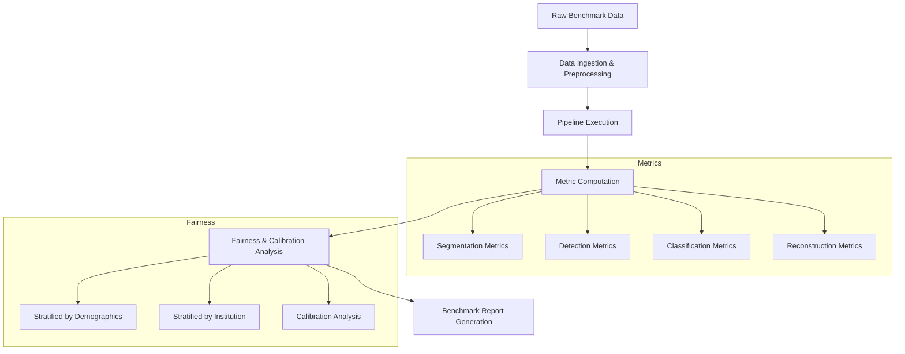
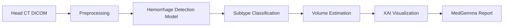

# Benchmark Plans

**
---

## Overview

This document defines benchmark suites for evaluating Rhenium OS across all supported modalities and clinical tasks.

---

## Evaluation Workflow



---

## MRI Benchmark Suites

### Knee MRI Benchmark

| Component | Specification |
|-----------|---------------|
| **Dataset** | Multi-site knee MRI dataset with meniscus and cartilage annotations |
| **Sequences** | PD-FS, T2, T1 (sagittal, coronal) |
| **Pipeline** | `mri_knee_default.yaml` |
| **Tasks** | Meniscus segmentation, cartilage grading, ligament detection |
| **Primary Metrics** | Dice (meniscus), Cohen's kappa (cartilage), AUC (ligament) |
| **Volume** | 500+ studies target |

```yaml
benchmark:
  name: knee_mri_benchmark
  modality: MRI
  body_part: KNEE
  tasks:
    - meniscus_segmentation
    - cartilage_grading
    - ligament_detection
  metrics:
    - dice
    - auc
    - cohens_kappa
  fairness:
    stratify_by: [age_group, sex, scanner_vendor]
```

### Brain MRI Benchmark

| Component | Specification |
|-----------|---------------|
| **Dataset** | Multi-site brain MRI with lesion annotations |
| **Sequences** | T1, T2, FLAIR, DWI |
| **Pipeline** | `mri_brain_lesions.yaml` |
| **Tasks** | WM lesion segmentation, hemorrhage detection, atrophy quantification |
| **Primary Metrics** | Dice, lesion-wise F1, volume correlation |
| **Volume** | 1000+ studies target |

### Prostate MRI Benchmark

| Component | Specification |
|-----------|---------------|
| **Dataset** | Multi-parametric prostate MRI dataset |
| **Sequences** | T2, DWI/ADC, DCE |
| **Pipeline** | `mri_prostate_pirads.yaml` |
| **Tasks** | Zone segmentation, lesion detection, PI-RADS classification |
| **Primary Metrics** | Dice (zones), sensitivity at fixed FP rate, weighted kappa |
| **Volume** | 300+ studies target |

---

## CT Benchmark Suites

### Head CT Benchmark (ICH Detection)

| Component | Specification |
|-----------|---------------|
| **Dataset** | Multi-site head CT with hemorrhage annotations |
| **Protocols** | Non-contrast head CT |
| **Pipeline** | `ct_head_ich_detection.yaml` |
| **Tasks** | ICH detection, subtype classification, volume estimation |
| **Primary Metrics** | AUC, sensitivity at 95% specificity, volume error |
| **Volume** | 2000+ studies target |



### Lung Nodule Detection Benchmark

| Component | Specification |
|-----------|---------------|
| **Dataset** | Thoracic CT screening dataset |
| **Protocols** | Low-dose chest CT |
| **Pipeline** | `ct_lung_nodule_detection.yaml` |
| **Tasks** | Nodule detection, size measurement, malignancy risk estimation |
| **Primary Metrics** | FROC, sensitivity at 0.125/1/4 FP per scan, AUC |
| **Volume** | 1000+ scans target |

### CT Angiography Benchmark

| Component | Specification |
|-----------|---------------|
| **Dataset** | Pulmonary and coronary CTA datasets |
| **Protocols** | Contrast-enhanced CTA |
| **Pipeline** | `cta_vessel_analysis.yaml` |
| **Tasks** | PE detection, stenosis grading, aneurysm detection |
| **Primary Metrics** | Segment-level AUC, per-patient sensitivity/specificity |
| **Volume** | 500+ studies target |

---

## X-ray Benchmark Suites

### Chest Radiography Benchmark

| Component | Specification |
|-----------|---------------|
| **Dataset** | Large-scale frontal chest X-ray dataset |
| **Views** | PA, AP |
| **Pipeline** | `xray_chest_abnormality.yaml` |
| **Tasks** | Multi-label abnormality classification, cardiomegaly detection |
| **Primary Metrics** | AUC per finding, macro-averaged AUC |
| **Volume** | 10,000+ images target |

### Mammography Benchmark

| Component | Specification |
|-----------|---------------|
| **Dataset** | Digital mammography screening dataset |
| **Views** | CC, MLO |
| **Pipeline** | `mammo_lesion_detection.yaml` |
| **Tasks** | Mass detection, calcification detection, density classification |
| **Primary Metrics** | FROC, AUC, sensitivity at 90% specificity |
| **Volume** | 5,000+ exams target |

### Skeletal Radiography Benchmark

| Component | Specification |
|-----------|---------------|
| **Dataset** | Extremity and spine radiograph dataset |
| **Views** | Multiple projections |
| **Pipeline** | `xray_bone_fracture.yaml` |
| **Tasks** | Fracture detection, anatomical localization |
| **Primary Metrics** | AUC, localization accuracy |
| **Volume** | 2,000+ images target |

---

## Ultrasound Benchmark Suites

### Liver Ultrasound Benchmark

| Component | Specification |
|-----------|---------------|
| **Dataset** | Liver B-mode ultrasound dataset |
| **Modes** | B-mode, contrast-enhanced |
| **Pipeline** | `us_liver_lesion_detection.yaml` |
| **Tasks** | Focal lesion detection, characterization |
| **Primary Metrics** | AUC, sensitivity, Dice |
| **Volume** | 500+ studies target |

### Vascular Ultrasound Benchmark

| Component | Specification |
|-----------|---------------|
| **Dataset** | Carotid duplex ultrasound dataset |
| **Modes** | B-mode, color Doppler, spectral Doppler |
| **Pipeline** | `us_carotid_plaque.yaml` |
| **Tasks** | Plaque detection, stenosis estimation |
| **Primary Metrics** | AUC, correlation with reference standard |
| **Volume** | 300+ studies target |

### Liver Elastography Benchmark

| Component | Specification |
|-----------|---------------|
| **Dataset** | Shear wave elastography dataset |
| **Modes** | SWE with B-mode |
| **Pipeline** | `us_liver_elastography.yaml` |
| **Tasks** | Fibrosis staging |
| **Primary Metrics** | Ordinal AUC, weighted kappa vs. biopsy |
| **Volume** | 200+ studies target |

---

## Multi-Modality Summary Table

| Modality | Subtype | Benchmark Suite | Primary Task | Key Metric |
|----------|---------|-----------------|--------------|------------|
| MRI | Knee | knee_mri_benchmark | Meniscus segmentation | Dice > 0.85 |
| MRI | Brain | brain_mri_benchmark | WM lesion segmentation | Dice > 0.80 |
| MRI | Prostate | prostate_mri_benchmark | Lesion detection | AUC > 0.85 |
| CT | Head | head_ct_benchmark | ICH detection | AUC > 0.95 |
| CT | Chest | lung_nodule_benchmark | Nodule detection | Sens > 90% at 1 FP/scan |
| CT | Vessel | cta_benchmark | PE detection | AUC > 0.90 |
| X-ray | Chest | chest_xray_benchmark | Multi-label classification | AUC > 0.80 |
| X-ray | Mammo | mammo_benchmark | Mass detection | AUC > 0.85 |
| X-ray | Skeletal | bone_xray_benchmark | Fracture detection | AUC > 0.90 |
| US | Liver | liver_us_benchmark | Lesion detection | AUC > 0.80 |
| US | Vascular | carotid_us_benchmark | Stenosis estimation | Correlation > 0.85 |

---

## Fairness Evaluation Protocol

All benchmarks include fairness analysis:

1. **Demographic Stratification**
   - Age groups: <40, 40-60, 60-80, >80
   - Sex: Male, Female
   - Ethnicity (where legally permissible)

2. **Technical Stratification**
   - Scanner vendor
   - Institution
   - Protocol variation

3. **Metrics per Stratum**
   - Primary task metric (e.g., AUC)
   - Calibration (ECE)
   - Disparity ratio

4. **Thresholds**
   - Maximum disparity: 0.10 (absolute difference)
   - Minimum disparity ratio: 0.80

---

**Copyright (c) 2025 Skolyn LLC. All rights reserved.**

****
