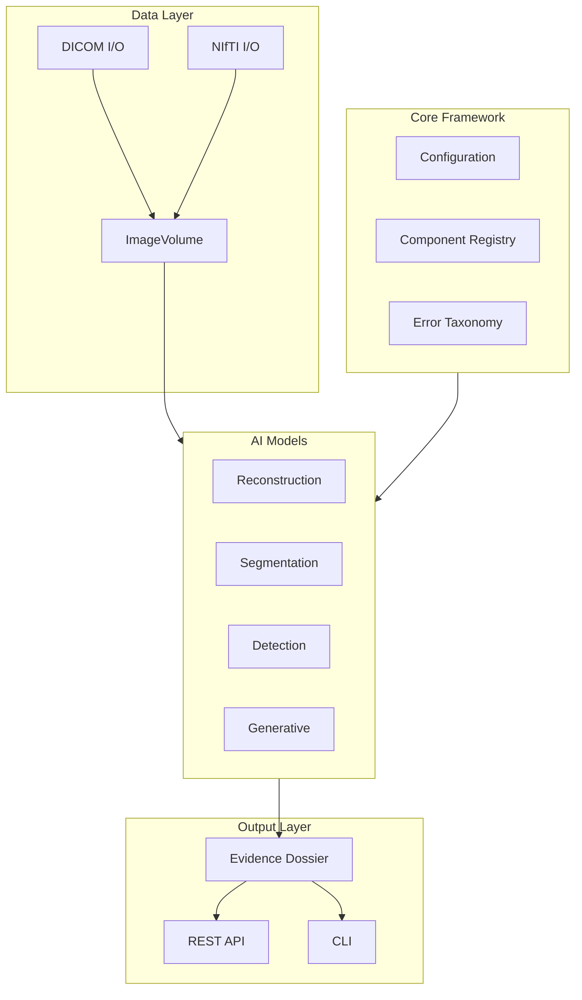

# Rhenium OS

[](https://www.python.org/)
[](https://eupl.eu/)
[](https://pytorch.org/)
[](https://monai.io/)

**Multi-Modality AI Platform for Medical Imaging Research**

---

## Overview

Rhenium OS is a comprehensive platform for medical imaging AI research, supporting:

- **MRI, CT, Ultrasound, X-ray** modalities
- **Reconstruction** with Physics-Informed Neural Networks
- **Perception** (segmentation, detection, classification)
- **Generative** models with disclosure tracking
- **Evidence Dossier** framework for transparent XAI

## Architecture



## Quick Start

```bash
pip install rhenium-os

# Run benchmark with synthetic data
rhenium benchmark

# Start API server
rhenium serve
```

## Documentation

- [Installation Guide](getting-started/installation.md)
- [Quick Start](getting-started/quickstart.md)
- [API Reference](api/core.md)
- [Mathematical Foundations](math/foundations.md)

## Disclaimer

> ⚠️ **Research Use Only**: This software is not approved for clinical use. All AI findings require verification by qualified medical professionals.
