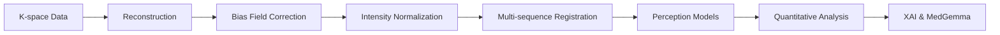
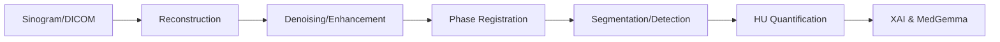
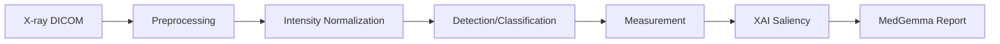
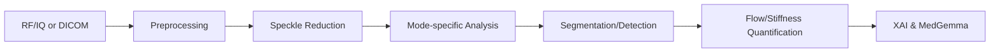

# Multi-Modality Reference

---

## Overview

This document provides comprehensive reference information for all imaging modalities supported by Rhenium OS.

---

## MRI (Magnetic Resonance Imaging)

### Sequences and Protocols

| Sequence | Clinical Application | Key Parameters |
|----------|---------------------|----------------|
| T1-weighted | Anatomy, post-contrast lesion enhancement | Short TE, short TR |
| T2-weighted | Pathology detection (edema, inflammation) | Long TE, long TR |
| FLAIR | White matter lesions, suppressed CSF | Long TE, long TR, TI at CSF null |
| PD (Proton Density) | Cartilage, meniscus evaluation | Long TR, short TE |
| DWI/ADC | Acute stroke, cellularity, restricted diffusion | b-values: 0, 500, 1000 s/mm² |
| T1 Mapping | Myocardial fibrosis, tissue characterization | Multiple inversion times |
| T2 Mapping | Cartilage degeneration, iron overload | Multiple echo times |
| DCE-MRI | Perfusion, tumor vascularity | Rapid T1-weighted with contrast |
| fMRI (BOLD) | Brain activation mapping | T2*-weighted EPI |

### Signal Equation

$$S = \rho \cdot e^{-\text{TE}/T_2} \cdot (1 - e^{-\text{TR}/T_1})$$

### MRI Pipeline Flow

### Supported Clinical Applications

| Body Region | Tasks | Pipeline |
|-------------|-------|----------|
| Knee | Meniscus tear, cartilage grading, ligament injury | `mri_knee_default.yaml` |
| Brain | WM lesions, tumor, hemorrhage, atrophy | `mri_brain_lesions.yaml` |
| Prostate | PI-RADS scoring, zone segmentation | `mri_prostate_pirads.yaml` |
| Breast | Lesion detection, kinetic analysis | `mri_breast_lesions.yaml` |
| Spine | Disc degeneration, cord compression | `mri_spine_degenerative.yaml` |
| Cardiac | Myocardial segmentation, scar quantification | `mri_cardiac_function.yaml` |

---

## CT (Computed Tomography)

### Protocols and Phases

| Protocol | Contrast | Clinical Application |
|----------|----------|---------------------|
| Non-contrast | None | Hemorrhage, calcium, bone |
| Arterial phase | Early | Tumors, vessel patency |
| Portal venous | Peak | Liver lesions, organ enhancement |
| Delayed | Late | Washout characteristics |
| CT Angiography (CTA) | Arterial | Vessel stenosis, aneurysm, PE |
| CT Perfusion (CTP) | Dynamic | Stroke, tumor perfusion |
| Low-dose CT | None/minimal | Lung cancer screening |

### Hounsfield Unit Reference

$$\text{HU} = 1000 \times \frac{\mu - \mu_{\text{water}}}{\mu_{\text{water}}}$$

| Tissue | Typical HU Range |
|--------|------------------|
| Air | -1000 |
| Fat | -100 to -50 |
| Water | 0 |
| Muscle | 40-60 |
| Blood (acute) | 60-90 |
| Bone cortex | 300-3000 |

### CT Pipeline Flow

### Supported Clinical Applications

| Body Region | Tasks | Pipeline |
|-------------|-------|----------|
| Head | ICH detection, stroke, trauma | `ct_head_ich_detection.yaml` |
| Chest | Lung nodules, PE, aortic disease | `ct_lung_nodule_detection.yaml` |
| Abdomen | Liver lesions, pancreas, kidney | `ct_abdomen_lesions.yaml` |
| Cardiac | Coronary calcium, stenosis | `ct_cardiac_cta.yaml` |
| Angiography | Vessel patency, stenosis | `cta_vessel_analysis.yaml` |

---

## X-ray

### Views and Projections

| Type | Standard Views | Clinical Application |
|------|----------------|---------------------|
| Chest Radiography | PA, Lateral, AP | Lung pathology, cardiomegaly |
| Skeletal | AP, Lateral, Oblique | Fractures, alignment |
| Mammography | CC, MLO | Breast mass, calcifications |
| Fluoroscopy | Real-time | GI, interventional |

### Beer-Lambert Law

$$I = I_0 \cdot e^{-\int \mu(s) \, ds}$$

### Cardiothoracic Ratio

$$\text{CTR} = \frac{W_{\text{cardiac}}}{W_{\text{thoracic}}}$$

Normal: CTR < 0.5

### X-ray Pipeline Flow

### Supported Clinical Applications

| Type | Tasks | Pipeline |
|------|-------|----------|
| Chest | Multi-label abnormality, cardiomegaly | `xray_chest_abnormality.yaml` |
| Skeletal | Fracture detection, alignment | `xray_bone_fracture.yaml` |
| Mammography | Mass and calcification detection | `mammo_lesion_detection.yaml` |

---

## Ultrasound

### Imaging Modes

| Mode | Description | Clinical Application |
|------|-------------|---------------------|
| B-mode | 2D grayscale anatomical imaging | All standard US exams |
| Color Doppler | Flow direction (color overlay) | Vascular patency |
| Spectral Doppler | Velocity waveform analysis | Stenosis quantification |
| Power Doppler | Flow presence (no direction) | Low-flow vessels |
| Elastography | Tissue stiffness mapping | Liver fibrosis, breast lesions |
| Contrast-enhanced | Microbubble enhancement | Tumor characterization |

### Key Measurements

| Measurement | Formula | Clinical Use |
|-------------|---------|--------------|
| Peak Systolic Velocity (PSV) | Direct measure | Stenosis grading |
| End Diastolic Velocity (EDV) | Direct measure | Vascular resistance |
| Resistive Index (RI) | $(PSV - EDV) / PSV$ | Renal, transplant |
| Pulsatility Index (PI) | $(PSV - EDV) / V_{mean}$ | Cerebral, fetal |
| Shear Wave Velocity (SWV) | m/s to kPa | Fibrosis staging |

### Ultrasound Pipeline Flow

### Supported Clinical Applications

| Body Region | Tasks | Pipeline |
|-------------|-------|----------|
| Liver | Focal lesion detection, fibrosis | `us_liver_lesion_detection.yaml` |
| Vascular | Carotid plaque, stenosis | `us_carotid_plaque.yaml` |
| Thyroid | Nodule detection, TI-RADS | `us_thyroid_nodule.yaml` |
| Obstetric | Biometry, anatomy survey | `us_obstetric_screening.yaml` |
| Elastography | Liver stiffness staging | `us_liver_elastography.yaml` |

---

## Cross-Modality Comparison

| Feature | MRI | CT | X-ray | Ultrasound |
|---------|-----|----|----|------------|
| Ionizing radiation | No | Yes | Yes | No |
| Soft tissue contrast | Excellent | Good | Limited | Good |
| Bone imaging | Limited | Excellent | Excellent | Limited |
| Real-time | Limited | No | Fluoroscopy | Yes |
| Cost | High | Medium | Low | Low |
| Portability | No | No | Limited | Yes |
| Primary data | K-space | Sinogram | Projection | RF/IQ |

---

**Copyright (c) 2025 Skolyn LLC. All rights reserved.**

