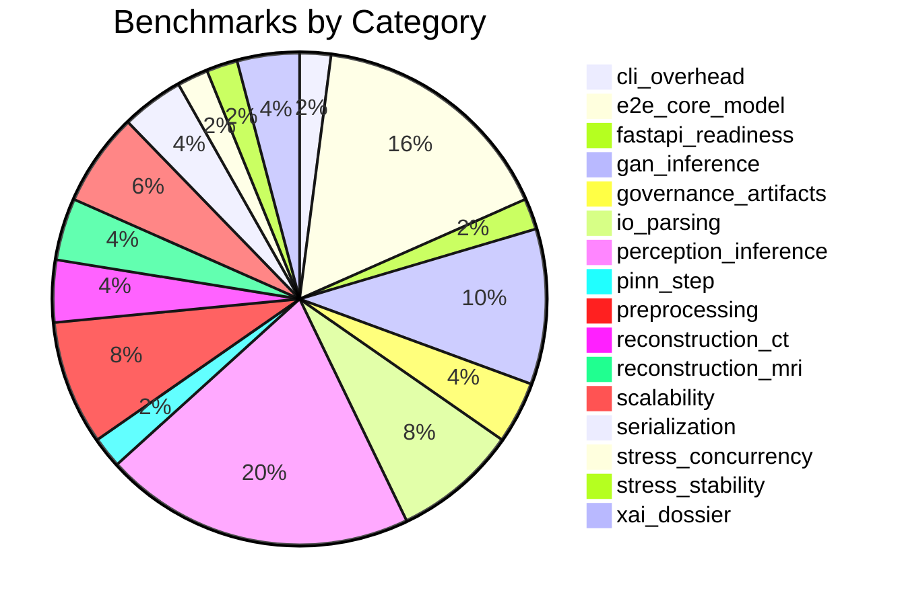
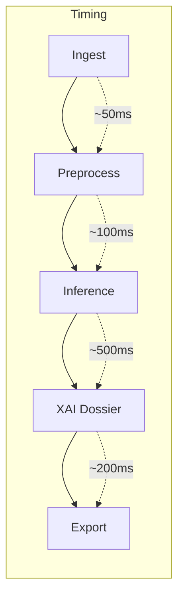
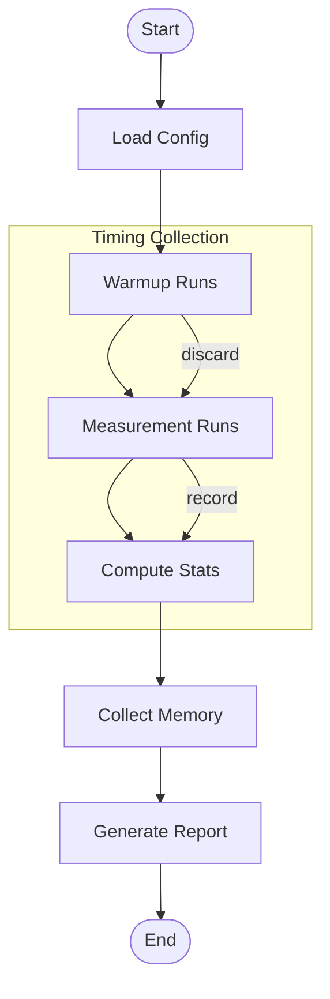
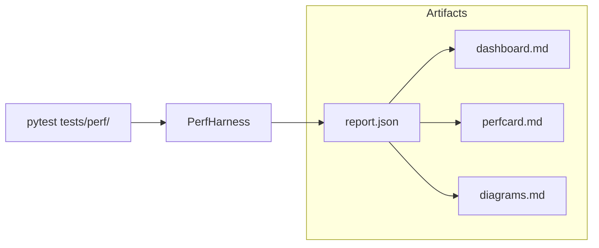

# Performance Diagrams

## Benchmark Distribution by Category

```mermaid
pie title Benchmarks by Category
    "cli_overhead" : 1
    "e2e_core_model" : 8
    "fastapi_readiness" : 1
    "gan_inference" : 5
    "governance_artifacts" : 2
    "io_parsing" : 4
    "perception_inference" : 10
    "pinn_step" : 1
    "preprocessing" : 4
    "reconstruction_ct" : 2
    "reconstruction_mri" : 2
    "scalability" : 3
    "serialization" : 2
    "stress_concurrency" : 1
    "stress_stability" : 1
    "xai_dossier" : 2
```

## Pipeline Timing Breakdown

```mermaid
flowchart LR
    A[Ingest] --> B[Preprocess]
    B --> C[Inference]
    C --> D[XAI Dossier]
    D --> E[Export]
    
    subgraph Timing
    A -.->|~50ms| B
    B -.->|~100ms| C
    C -.->|~500ms| D
    D -.->|~200ms| E
    end
```

## Benchmark Execution Flow

```mermaid
flowchart TD
    Start([Start]) --> Config[Load Config]
    Config --> Warmup[Warmup Runs]
    Warmup --> Measure[Measurement Runs]
    Measure --> Stats[Compute Stats]
    Stats --> Memory[Collect Memory]
    Memory --> Report[Generate Report]
    Report --> End([End])
    
    subgraph Timing Collection
    Warmup -->|discard| Measure
    Measure -->|record| Stats
    end
```

## Artifact/Reporting Flow

```mermaid
flowchart LR
    Tests[pytest tests/perf/] --> Harness[PerfHarness]
    Harness --> JSON[report.json]
    JSON --> Dashboard[dashboard.md]
    JSON --> Perfcard[perfcard.md]
    JSON --> Diagrams[diagrams.md]
    
    subgraph Artifacts
    JSON
    Dashboard
    Perfcard
    Diagrams
    end
```
