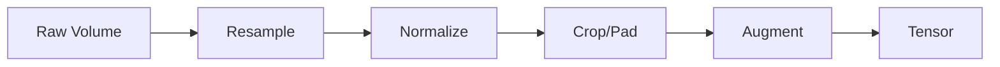

# Data Handling Guide

## Supported Formats

| Format | Read | Write | Notes |
|--------|------|-------|-------|
| DICOM | ✅ | ❌ | Full PS3.10 support |
| NIfTI | ✅ | ✅ | .nii and .nii.gz |
| HDF5 | ✅ | ✅ | For k-space data |

## Working with DICOM

### Loading Studies

```python
from rhenium.data.dicom import load_dicom_directory

study = load_dicom_directory(
    "./path/to/dicom",
    deidentify=True,  # Remove PHI
)

print(f"Study UID: {study.study_uid}")
print(f"Series count: {len(study.series)}")

for series in study.series:
    print(f"  - {series.modality}: {series.description}")
    volume = series.to_volume()
```

### De-identification

PHI removal follows DICOM PS3.15:

```python
from rhenium.data.dicom import deidentify_dataset, DeidentificationProfile

# Basic de-id (remove direct identifiers)
deidentify_dataset(dataset, profile=DeidentificationProfile.BASIC)

# Clean (remove more fields)
deidentify_dataset(dataset, profile=DeidentificationProfile.CLEAN)
```

---

## Modality-Specific Processing

### MRI

```python
from rhenium.data.modality.mri import apply_bias_field_correction, skull_strip

# N4 bias correction
corrected = apply_bias_field_correction(mri_volume)

# Skull stripping
brain, mask = skull_strip(corrected, threshold=0.1)
```

### CT

```python
from rhenium.data.modality.ct import segment_lungs, segment_body

body_mask = segment_body(ct_volume)
lung_mask = segment_lungs(ct_volume)

# Window presets
from rhenium.data.volume import CTWindow
lung_window = ct_volume.apply_window_preset(CTWindow.LUNG)
```

### Ultrasound

```python
from rhenium.data.modality.us import despeckle, log_compress

# Reduce speckle noise
filtered = despeckle(us_image, filter_type="lee", size=5)

# Log compress for display
display = log_compress(filtered, dynamic_range=60)
```

---

## Preprocessing Pipeline



### Custom Pipeline

```python
from rhenium.data.preprocessing import (
    PreprocessingPipeline, Resample, Normalize, CropOrPad
)

pipeline = PreprocessingPipeline(steps=[
    Resample(target_spacing=(1.0, 1.0, 1.0)),
    Normalize(method="zscore"),
    CropOrPad(target_size=(128, 128, 64)),
])

processed = pipeline(volume)
```
